# Edit 1 Context Engineering Tutorial Plan 2026-04-18 15:23 Branch: no-git

## Context Engineering Learning Sequence (Mermaid)

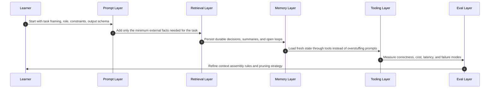

## Tutorial Build Ladder Sequence (Mermaid)

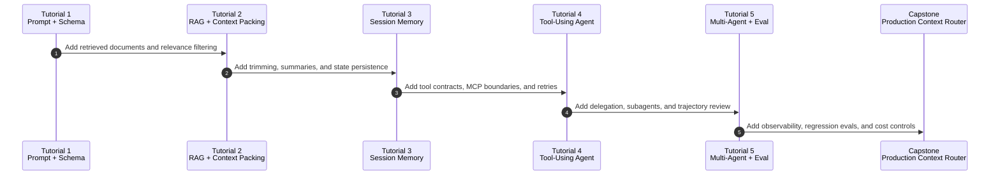

## Implementation Notes

- Goal: learn context engineering as a systems discipline, not a prompt-writing trick.
- Recommended order: `prompting -> retrieval -> memory -> tools -> orchestration -> evals -> production optimization`.
- Success criterion: by the capstone, the system should reliably decide what to put in context, what to fetch just-in-time, what to summarize, and what to keep outside the context window.

## Core Concepts To Learn

### 1. Context Assembly

- System prompts, task prompts, examples, structured outputs, and guardrails.
- The main skill is selecting the smallest high-signal token set for the next step.
- Learn failure modes: vague prompts, contradictory instructions, stale retrieved context, and oversized tool schemas.

### 2. Retrieval And Context Packing

- Query rewriting, chunking, reranking, top-k selection, citation grounding, and source trust.
- Learn to treat RAG as one input channel, not the whole architecture.
- Practice packing retrieved evidence near the decision point rather than dumping long documents into the window.

### 3. Short-Term Memory

- Conversation state, turn windows, trimming, compaction, and summaries.
- Learn when to keep raw turns, when to compress, and when to restart the working context.
- Practice preserving exact recent turns while summarizing older decisions and open issues.

### 4. Long-Term Memory

- Durable notes, task state, user preferences, working files, and project memory.
- Learn the split between ephemeral working memory and persistent external memory.
- Practice explicit write/read rules so the agent does not pollute memory with low-value observations.

### 5. Tool And Protocol Design

- Function calling, tool contracts, MCP servers, permissions, retries, and tool-result pruning.
- Learn to expose narrow tools with clear decision boundaries.
- Practice just-in-time loading of data via tools rather than front-loading everything into prompts.

### 6. Agent Orchestration

- Single-agent loops, planner/executor splits, reviewer loops, and subagents.
- Learn when multi-agent designs reduce context load versus when they only add coordination overhead.
- Practice returning distilled summaries from workers back to a lead agent.

### 7. Evaluation

- Task-level correctness, citation quality, retrieval recall, tool success rate, latency, and token cost.
- Learn trajectory review: not only whether the final answer was correct, but whether the context path was efficient and robust.
- Practice building regression suites for context failures, not only output failures.

### 8. Production Optimization

- Prompt caching, context-window budgeting, streaming, observability, and safety controls.
- Learn that larger context windows reduce pressure but do not remove the need for pruning and relevance control.
- Practice building cost-aware policies for retrieval, memory reads, and compaction frequency.

## State Of The Art To Internalize (Post-2025)

### A. Context Engineering Replaced Pure Prompt Tuning

- Anthropic's September 29, 2025 engineering post is the clearest recent statement of the shift: context engineering is about curating the full token state available to the model, not only writing prompts.
- The important mental model is finite attention budget. More tokens can degrade recall and focus, so relevance beats volume.

### B. Just-In-Time Context Is Winning Over Naive Preloading

- Current agent guidance has shifted toward keeping lightweight references in memory and loading real data at runtime through tools.
- This enables progressive disclosure: the agent inspects the environment, loads only the useful slices, and keeps the working set small.

### C. Compaction And Memory Are First-Class

- The strongest post-2025 pattern is explicit context management: trim recent turns, summarize old turns, persist notes externally, and clear stale tool output.
- Short-term memory management is now documented as an engineering surface, not an implementation detail.

### D. Bigger Windows Help, But Do Not Remove Context Engineering

- Frontier systems now expose very large windows, but recent guidance still emphasizes compaction, note-taking, and pruning because context quality degrades when the window is stuffed.
- Context awareness and token-budget awareness improve execution, but they do not replace architecture work.

### E. Protocol Standardization Matters

- MCP is becoming a practical interoperability layer for connecting agents to tools, data, and workflows.
- You should treat protocol design as part of context engineering because the protocol determines what can be fetched, when, and at what granularity.

### F. Evals And Observability Are Part Of The Core Stack

- Modern agent stacks now ship with explicit tracing and evaluation paths.
- If you cannot inspect retrieval decisions, tool calls, summaries, and state transitions, you cannot improve the context policy with confidence.

## Core Libraries / Frameworks To Know

### Foundational APIs

- `OpenAI Responses API + Agents SDK`
  - Learn for: stateful conversations, tools, built-in file search/web search, compaction, prompt caching, and agent evaluation loops.
  - Use when: you want a modern first-party stack with strong tool support and direct context-management primitives.

- `Anthropic Claude API + memory/context guidance`
  - Learn for: context engineering mental models, memory patterns, tool design, and long-horizon task techniques.
  - Use when: you want the clearest recent applied guidance on compaction, note-taking, and subagent context isolation.

### Interoperability Layer

- `Model Context Protocol (MCP)`
  - Learn for: standardizing external tools, data sources, and reusable skills.
  - Use when: you want agents to fetch context from heterogeneous systems without custom one-off integrations everywhere.

### Python Orchestration

- `LangGraph`
  - Learn for: durable execution, stateful long-running agents, human-in-the-loop control, and production orchestration.
  - Best tutorial fit: implement planner/executor/reviewer graphs and inspect traces.

- `PydanticAI`
  - Learn for: typed agents, structured IO, dependency injection, and production-grade Python ergonomics.
  - Best tutorial fit: build smaller strongly-typed systems before moving to heavier orchestration.

- `DSPy`
  - Learn for: declarative LM programs, optimization, signatures, and eval-driven prompt/module tuning.
  - Best tutorial fit: learn how to optimize context strategies and modules systematically instead of hand-tweaking prompts.

- `LlamaIndex`
  - Learn for: knowledge-heavy systems, retrieval pipelines, workflows, and agentic RAG.
  - Best tutorial fit: build retrieval-centric assistants where data connectors and workflow composition matter.

### TypeScript Product Layer

- `Vercel AI SDK`
  - Learn for: shipping chat/product interfaces, provider abstraction, tool usage, message persistence, telemetry, and generative UI patterns.
  - Best tutorial fit: frontend or full-stack context-engineering demos where UX and streaming matter.

### Observability / Eval Adjacency

- `LangSmith`
  - Learn for: trace inspection, evaluation, and production debugging of agent workflows.
  - Best tutorial fit: compare alternative context policies on the same task set.

## Tutorials To Do

### Tutorial 1: Prompt Contract And Output Control

- Build a single-call assistant with strong system instructions, explicit constraints, and structured JSON output.
- Learn:
  - instruction hierarchy
  - schema-first outputs
  - example selection
  - refusal and fallback design
- Deliverable:
  - one API route
  - one eval set of 20 inputs
  - one failure log with prompt revisions

### Tutorial 2: Retrieval And Context Packing

- Build a document QA assistant over a small corpus.
- Learn:
  - chunking
  - top-k retrieval
  - reranking
  - citation grounding
  - packing only the evidence needed for the question
- Deliverable:
  - retrieval pipeline
  - citation-aware answer formatter
  - evals for false citations, missed evidence, and irrelevant context

### Tutorial 3: Session Memory And Compaction

- Build a multi-turn assistant that trims old turns, summarizes older state, and persists durable notes.
- Learn:
  - recent-turn retention
  - summary prompts
  - durable session memory
  - replay vs summary tradeoffs
- Deliverable:
  - memory policy document
  - session store
  - tests for memory drift and summary omission

### Tutorial 4: Tool-Using Agent With MCP

- Build an agent that can read local docs, query a simple database, and call at least one external tool through MCP or an equivalent tool interface.
- Learn:
  - tool schema design
  - permissions
  - retries
  - tool-result pruning
  - just-in-time loading
- Deliverable:
  - 3 to 5 tools
  - trace logs
  - failure cases for wrong tool choice and oversized tool outputs

### Tutorial 5: Multi-Agent Research Workflow

- Build a lead agent that delegates retrieval or analysis to focused subagents and receives compressed summaries back.
- Learn:
  - decomposition
  - summary contracts
  - context isolation
  - reviewer loops
  - parallel search vs unnecessary agent sprawl
- Deliverable:
  - planner
  - 2 workers
  - reviewer
  - eval showing when multi-agent improves quality or speed

### Tutorial 6: Capstone Production Context Router

- Build an app that decides per request which context sources to load: prompt template, memory, retrieval, tool output, or human escalation.
- Learn:
  - policy routing
  - token budgeting
  - caching
  - tracing
  - cost/latency tradeoffs
- Deliverable:
  - routing policy
  - live traces
  - regression suite
  - dashboard for quality, cost, and latency

## Suggested Learning Order

### Week 1

- Learn prompt contracts and structured outputs.
- Finish Tutorial 1.

### Week 2

- Learn retrieval, ranking, and evidence packing.
- Finish Tutorial 2.

### Week 3

- Learn short-term memory, summaries, and compaction.
- Finish Tutorial 3.

### Week 4

- Learn tool design and MCP.
- Finish Tutorial 4.

### Week 5

- Learn orchestration patterns and subagents.
- Finish Tutorial 5.

### Week 6

- Learn tracing, evals, and cost control.
- Finish Tutorial 6.

## Research Basis

- Anthropic, `Effective context engineering for AI agents`, published September 29, 2025, should be treated as the primary conceptual source.
- OpenAI API guides on `Agents`, `Agents SDK`, `Using tools`, `Conversation state`, `Prompt caching`, and `Agent evals` should be treated as the primary implementation sources.
- MCP docs and specification revisions from 2025 should be treated as the primary protocol sources.
- Framework docs should be learned by layer rather than memorized all at once:
  - orchestration: `LangGraph`
  - typed Python agents: `PydanticAI`
  - optimization and eval-driven tuning: `DSPy`
  - retrieval-heavy workflows: `LlamaIndex`
  - product UI delivery: `Vercel AI SDK`

## Rollout Notes

- Start in Python unless your main target is frontend product work, in which case pair Python backends with `Vercel AI SDK` on the UI side.
- Do not start with multi-agent systems. Earn them by first making single-agent context assembly reliable.
- Treat every tutorial as an eval project. If a tutorial does not produce trace data and failure cases, it is incomplete.

# Edit 2 AI Chat 03 RAG Chat 2026-04-19 11:42 Branch: main

## Terminal RAG Chat Request Sequence (Mermaid)

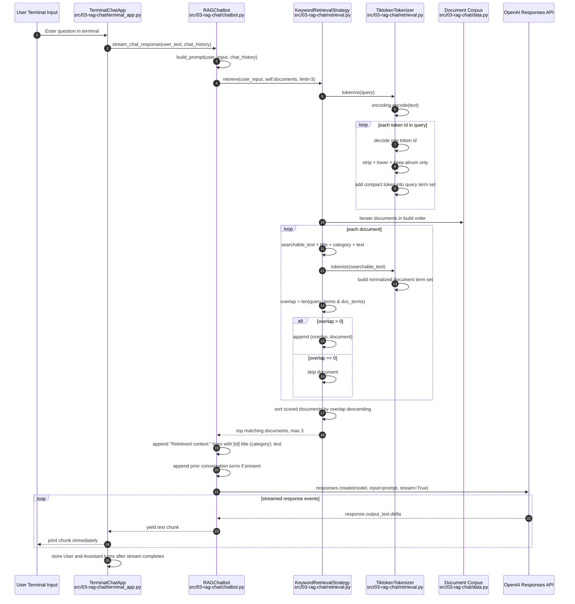

## Retrieval Edge Cases Sequence (Mermaid)

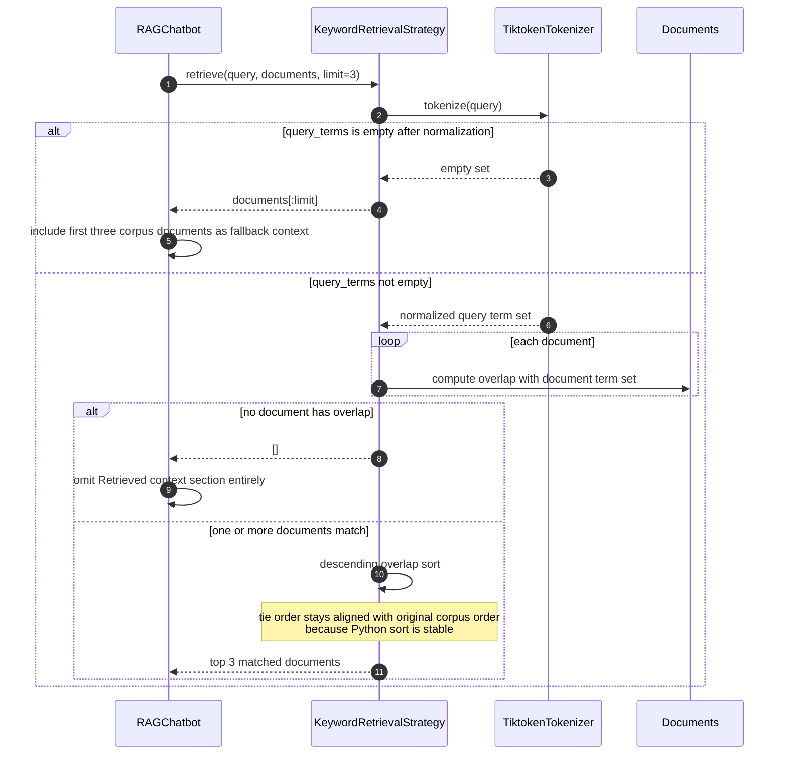

## Implementation Notes

- Composition root: `main.py` wires `Settings`, `AsyncOpenAI`, `TiktokenTokenizer`, `KeywordRetrievalStrategy`, `RAGChatbot`, and `TerminalChatApp`.
- Corpus construction is static. `data.py` converts `RAW_DOCUMENTS` into immutable `Document` dataclass instances once during startup.
- Retrieval is purely lexical. There is no embedding index, vector store, reranker, or persistence layer in this tutorial.
- `TiktokenTokenizer.tokenize()` produces a `set[str]` of normalized terms, not an ordered token stream. Duplicate terms are intentionally collapsed before scoring.
- Normalization in `retrieval.py` is strict:
  - token ids come from `tiktoken.encoding_for_model(model)` with fallback to `o200k_base`
  - each token id is decoded individually
  - whitespace is stripped
  - text is lowercased
  - non-alphanumeric characters are removed
  - empty results are discarded
- Document scoring is simple set intersection. A document score is the count of unique normalized terms shared by query and document, not frequency-weighted relevance.
- Document text used for retrieval is assembled from `title`, `category`, and `text`. This means category labels such as `hr` or `security` can directly influence ranking.
- Matching documents are stored as `(overlap, document)` tuples, sorted in descending score order, and truncated to `limit=3`.
- Tie behavior is deterministic relative to corpus order because the sort key only uses overlap and Python sorting is stable.
- Prompt construction is additive:
  - start with the system prompt
  - add retrieved document bullets only if retrieval returns at least one document
  - add full chat history if present
  - append the current `User:` turn and final `Assistant:` cue
- The chat loop keeps conversation history only in process memory inside `TerminalChatApp.chat_history`. Restarting the process drops prior turns.
- Streaming is one-way from the OpenAI Responses API into the terminal. The assistant response is buffered locally only so the completed answer can be stored back into chat history after printing.

## Retrieval Notes

- The retrieval fallback is asymmetric:
  - empty normalized query returns the first three documents
  - non-empty query with zero matches returns no documents
- That asymmetry means punctuation-only or otherwise non-alphanumeric queries still inject default context into the prompt, while specific unmatched queries do not.
- Because scoring is based on unique-term overlap, repeated words in a document do not increase its rank.
- Because each document is retokenized on every user turn, retrieval cost scales linearly with both corpus size and document length for every prompt build.

# Edit 3 RAG Retrieval Hardening 2026-04-19 17:53 Branch: feat/retrieval/embeddings

## Shared Retrieval Text Sequence (Mermaid)

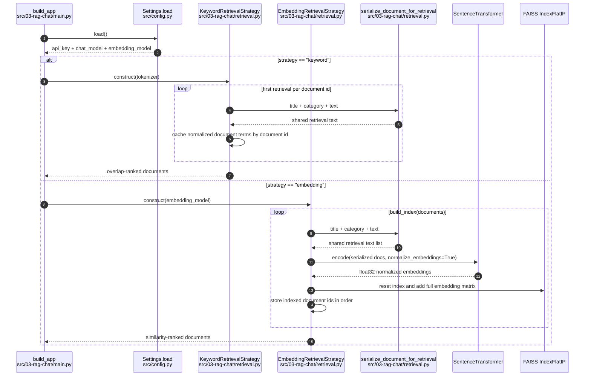

## Low Confidence Embedding Failure Path Sequence (Mermaid)

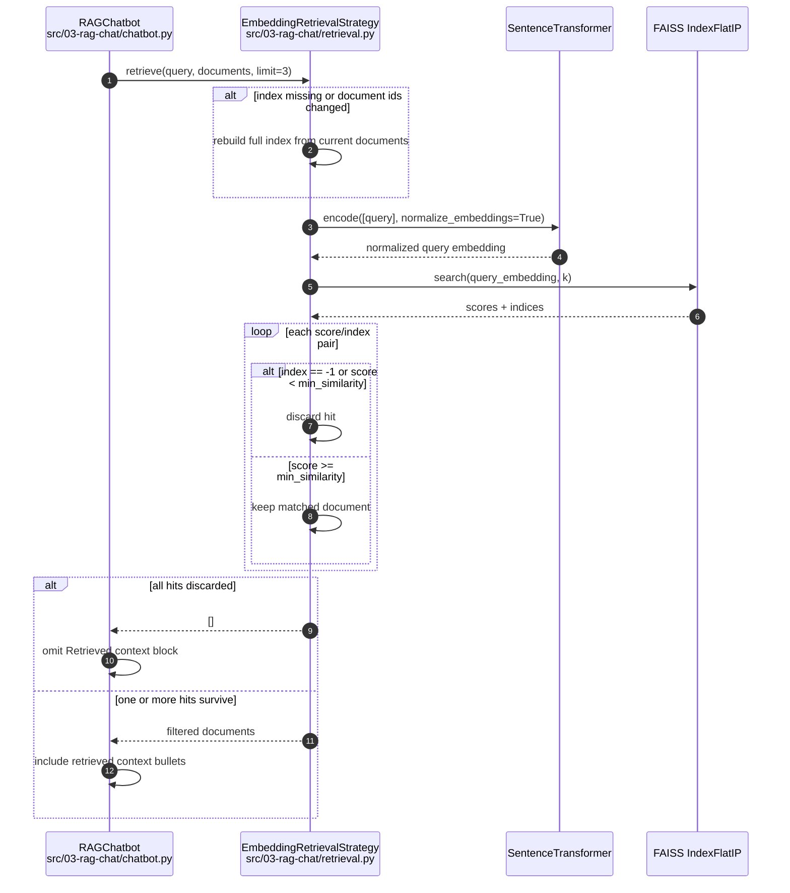

## Implementation Notes

- `OPENAI_MODEL` now stays on the chat path while `EMBEDDING_MODEL` is used only when the embedding retrieval strategy is selected.
- `serialize_document_for_retrieval()` is the single retrieval text formatter for both keyword and embedding strategies, so title and category signal are preserved consistently across both paths.
- `KeywordRetrievalStrategy` now caches normalized document term sets by document id instead of retokenizing document text on every query.
- `EmbeddingRetrievalStrategy.build_index()` now recreates the FAISS index on every rebuild and tracks the indexed document id order to avoid stale or duplicated vectors.
- Embedding search uses normalized vectors with `IndexFlatIP`, then applies a `min_similarity` threshold before passing any documents into the prompt.

## Executive Verdict

- Retrieval correctness improved materially. The branch now fixes the chat-vs-embedding model split, prevents stale FAISS state from accumulating across rebuilds, and stops low-confidence embedding hits from being injected as supporting context.
- Residual quality limits remain deliberate: keyword retrieval is still overlap-based rather than BM25-style, and there is still no corpus-level retrieval eval dataset.

## Runtime Check

- `uv run python -m py_compile src/config.py src/03-rag-chat/main.py src/03-rag-chat/retrieval.py tests/test_rag_retrieval.py tests/test_ai_chat_entrypoints.py` passed.
- `uv run pytest tests/test_rag_retrieval.py`, `uv run pytest tests/test_ai_chat_entrypoints.py`, and `make test` were started in the sandbox but did not produce a usable completion signal before timeout/TTY limitations. The test intent is documented below; final PR notes should call out that the static compile check completed while live pytest confirmation remained inconclusive in this environment.

## Scoring Scale

- `Overall`, `Useful`, `Critical`, `Design`: `1` low, `5` high.
- `Redundant`: `1` not redundant, `5` highly redundant.

## Per-Test Review

### Retrieval Regression Suite

| Ref | De Facto Test Name | What it proves | Overall | Useful | Critical | Redundant | Design | Review |
| --- | --- | --- | --- | --- | --- | --- | --- | --- |
| R1 | `test_settings_uses_separate_chat_and_embedding_models` | The runtime no longer conflates the OpenAI chat model with the Hugging Face embedding model identifier. | 5 | 5 | 5 | 1 | 4 | Directly covers the original production breakage and keeps the config contract explicit. |
| R2 | `test_serialize_document_for_retrieval_includes_all_relevant_fields` | Shared retrieval text includes `title`, `category`, and `text` for both retrieval strategies. | 4 | 4 | 4 | 1 | 4 | Small but load-bearing because keyword and embedding retrieval now rely on the same serialization helper. |
| R3 | `test_keyword_retrieval_uses_cached_document_terms` | Keyword retrieval reuses cached normalized term sets instead of re-tokenizing every document on repeat queries. | 4 | 4 | 3 | 1 | 4 | Good regression coverage for the performance-oriented behavior change without over-specifying ranking internals. |
| R4 | `test_keyword_retrieval_refreshes_cache_when_document_text_changes` | Keyword retrieval invalidates cached document terms when a document keeps the same id but its serialized retrieval text changes. | 5 | 5 | 4 | 1 | 5 | Covers the load-bearing stale-cache edge case for long-lived strategy instances. |
| R5 | `test_embedding_retrieval_indexes_shared_document_text` | Embedding indexing uses the same serialized document text as keyword retrieval, preserving title/category signal. | 5 | 5 | 4 | 1 | 4 | Important parity check between the two retrieval paths. |
| R6 | `test_embedding_retrieval_resets_index_on_rebuild` | FAISS state is reset on rebuild so stale vectors do not survive across corpus changes. | 5 | 5 | 5 | 1 | 5 | Most critical correctness guard in the new embedding path. |
| R7 | `test_embedding_retrieval_rebuilds_when_document_text_changes` | Embedding retrieval rebuilds when indexed documents keep the same id but their serialized retrieval text changes. | 5 | 5 | 5 | 1 | 5 | Prevents silent reuse of stale vectors when document content changes in place. |
| R8 | `test_embedding_retrieval_returns_empty_for_low_similarity_queries` | Low-confidence embedding matches are dropped instead of being injected into the prompt as false support. | 5 | 5 | 5 | 1 | 5 | Protects the grounded-answer contract at the prompt boundary, not just internal ranking semantics. |

# Edit 4 Keyword Retrieval Cache Tradeoffs 2026-04-20 14:28 Branch: feat/retrieval/embeddings

## Keyword Cache Request Sequence (Mermaid)

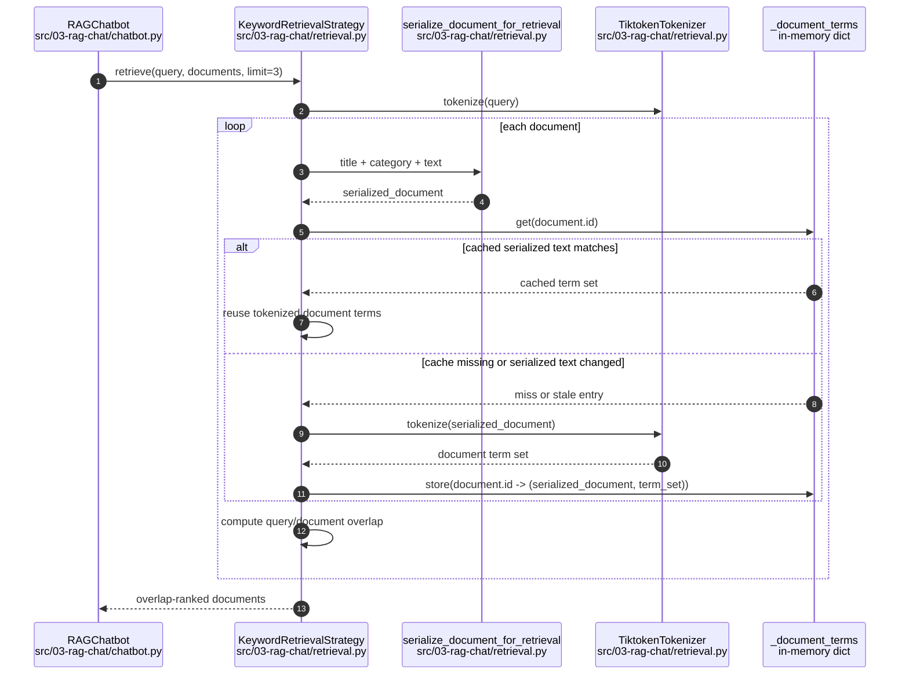

## Cache Value Threshold Sequence (Mermaid)

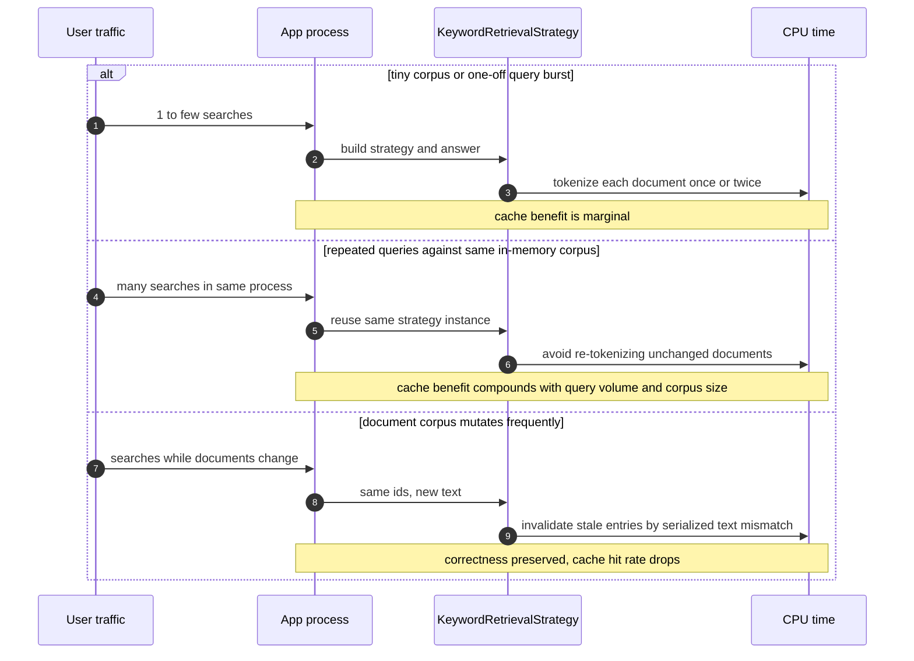

## Implementation Notes

- The cache solves repeated document-tokenization work, not retrieval quality. It exists to avoid recomputing the same normalized token set for unchanged documents on every query.
- The expensive part being avoided is the repeated `tokenizer.tokenize(serialized_document)` call for every document on every request. In this toy app that cost is modest; in a larger corpus or higher-query process it becomes steady CPU overhead.
- The fetch rule is exact-match invalidation, not a threshold:
  - reuse cached terms when `document.id` exists in `_document_terms` and the cached serialized text equals the current serialized text
  - recompute when the id is absent or the serialized text changed
- The cache is process-local and in-memory only:
  - no disk persistence
  - no TTL
  - no size-based eviction
  - no cross-worker sharing
- The practical win appears only when the same `KeywordRetrievalStrategy` instance serves multiple queries over mostly stable documents.

## Production Examples

- Internal policy bot with a few hundred static HR/IT/security documents and many employee questions per app process. Each question reuses the same document set, so cached document terms save repeated normalization work across every query.
- Customer support workspace assistant where agents ask many follow-up questions against the same knowledge base during one shift. Query text changes, but most document text does not, so the cache trades a small amount of RAM for lower repeated CPU cost.
- Multi-tenant RAG worker that keeps one corpus in memory per tenant for minutes or hours. The cache helps when each tenant has bursts of repeated searches and the worker does not rebuild state every request.
- It matters much less for a CLI demo where a user asks one question and exits, or for a serverless handler that rebuilds the process on each request.

## When You Do Not Need It

- One-off scripts, notebooks, or CLIs where the process serves very few queries before exiting.
- Very small corpora where re-tokenizing every document is operationally irrelevant and code simplicity matters more than CPU savings.
- Systems where documents are changing so frequently that cache hits are rare and the invalidation logic buys little.
- Architectures that already precompute or externalize lexical features elsewhere, such as a search engine or a BM25 index.

## Alternative Decisions And Tradeoffs

- Keep no cache:
  - simplest implementation
  - lowest memory usage
  - best when corpus size and query volume are both small
- In-memory per-process cache:
  - cheap and simple
  - no network hop
  - duplicated across workers and lost on restart
- Precomputed lexical index:
  - better when corpus is larger and retrieval is core product behavior
  - more upfront complexity and rebuild logic
  - usually a better long-term choice than hand-rolled overlap scoring
- External search backend:
  - highest operational complexity
  - strongest fit when you need ranking quality, filtering, facets, and multi-worker consistency
  - overkill for tutorial-scale corpora

## Design Guidance

- Use the current cache when:
  - documents are mostly stable
  - the same process serves repeated queries
  - you want a low-complexity optimization without adding infrastructure
- Skip it when:
  - the product is small enough that the repeated tokenization cost is noise
  - readability matters more than a micro-optimization
- Move to a real lexical index when:
  - query volume grows
  - corpus size grows beyond tutorial scale
  - ranking quality becomes more important than avoiding repeated tokenization

# Edit 5 Hybrid BM25 Retrieval 2026-04-20 16:45 Branch: feat/retrieval/hybrid

## Hybrid Retrieval Request Sequence (Mermaid)

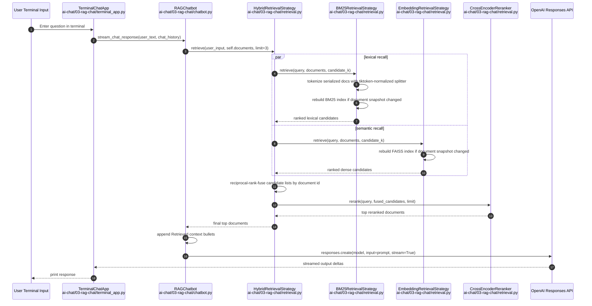

## Reranker Failure Path Sequence (Mermaid)

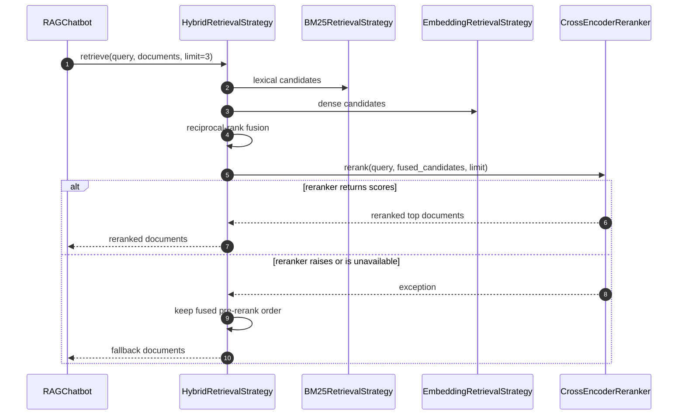

## Keyword vs BM25 Decision Matrix

| Dimension | Keyword Overlap | BM25 |
| --- | --- | --- |
| Ranking signal | Unique-term overlap only | Term frequency, inverse document frequency, and document-length normalization |
| Tokenization source | Shared tiktoken normalization | Same shared tiktoken normalization via custom `bm25s` splitter |
| Query/document cache | In-memory term-set cache | Full lexical index rebuild when serialized corpus changes |
| Repeated-word sensitivity | Repeated words do not help rank | Repeated informative terms can improve rank |
| Small-corpus simplicity | Simplest baseline | Slightly heavier but still local and dependency-light |
| Best role in this tutorial | Baseline and teaching reference | Real lexical retriever for hybrid recall |

## Implementation Notes

- `main.py` now supports `keyword`, `bm25`, `embedding`, and `hybrid` while keeping `keyword` as the default CLI path.
- `config.py` now loads `RERANKER_MODEL`, defaulting to `cross-encoder/ms-marco-MiniLM-L6-v2`.
- `retrieval.py` now shares one retrieval serialization function across keyword, BM25, dense retrieval, and reranking so title/category signal stays aligned.
- `TiktokenTokenizer` now exposes both:
  - a unique-token set for the legacy keyword strategy
  - an ordered token sequence for BM25 indexing and querying
- `BM25RetrievalStrategy` uses `bm25s` with a custom splitter backed by the same tiktoken normalization rules used by the keyword baseline.
- `EmbeddingRetrievalStrategy` keeps the existing sentence-transformer embedding model and FAISS cosine-similarity search semantics.
- `HybridRetrievalStrategy` fuses BM25 and dense candidate lists with reciprocal rank fusion before final cross-encoder reranking.
- The reranker failure policy is fail-open. If local reranking raises, the app still answers using fused pre-rerank candidates instead of aborting the turn.
- `cross-encoder/ms-marco-MiniLM-L6-v2` was chosen as the default local reranker because it is small, widely used, and integrates directly through `sentence_transformers.CrossEncoder`.

## Executive Verdict

- Retrieval quality now has a real progression:
  - `keyword` remains the simplest lexical baseline
  - `bm25` provides a stronger local lexical retriever
  - `embedding` preserves dense-only comparison
  - `hybrid` is the highest-quality path because it combines recall from BM25 and dense search, then sharpens final precision with reranking
- The main tradeoff is local complexity and runtime cost. Hybrid retrieval adds a BM25 index, a dense index, and a cross-encoder scoring pass, which is justified for comparison/tutorial value but would be unnecessary for the smallest baseline path.

## Runtime Check

- `uv add bm25s` completed successfully and updated the project dependency set.
- `uv run python -m py_compile ai-chat/config.py ai-chat/03-rag-chat/main.py ai-chat/03-rag-chat/retrieval.py tests/test_rag_retrieval.py tests/test_ai_chat_entrypoints.py` passed.
- `uv run pytest ...` did not produce a usable completion signal in this environment, so verification was completed with direct Python harness execution of the retrieval assertions and the entrypoint subprocess checks instead.

## Scoring Scale

- `Overall`, `Useful`, `Critical`, `Design`: `1` low, `5` high.
- `Redundant`: `1` not redundant, `5` highly redundant.

## Per-Test Review

### Retrieval Regression Suite

| Ref | De Facto Test Name | What it proves | Overall | Useful | Critical | Redundant | Design | Review |
| --- | --- | --- | --- | --- | --- | --- | --- | --- |
| H1 | `test_tiktoken_tokenizer_returns_bm25_sequence_tokens` | BM25 uses the same tiktoken-driven normalization family as the keyword baseline while preserving repeated token order. | 4 | 4 | 4 | 1 | 4 | Important contract test because tokenizer drift would quietly invalidate the keyword-vs-BM25 comparison. |
| H2 | `test_bm25_retrieval_indexes_shared_document_text` | BM25 indexes the same serialized retrieval text used everywhere else. | 5 | 5 | 4 | 1 | 4 | High-signal parity check across lexical, dense, and rerank layers. |
| H3 | `test_bm25_retrieval_rebuilds_when_document_text_changes` | BM25 does not reuse stale lexical state across corpus mutations. | 5 | 5 | 5 | 1 | 5 | Load-bearing because the BM25 tokenizer vocabulary and index must stay aligned. |
| H4 | `test_hybrid_retrieval_reranks_fused_candidates_with_cross_encoder` | Final hybrid ordering is controlled by the reranker rather than whichever first-stage retriever happened to rank a candidate earlier. | 5 | 5 | 5 | 1 | 5 | Core proof that the new architecture is actually rerank-first at the final selection boundary. |
| H5 | `test_hybrid_retrieval_falls_back_to_fused_order_when_reranker_raises` | Hybrid retrieval continues serving grounded context when local reranking fails. | 5 | 5 | 5 | 1 | 5 | Covers the chosen fail-open production behavior directly. |
| H6 | `test_build_app_supports_bm25_and_hybrid` | `main.py` wires the new strategies and eager index builds correctly at the composition root. | 4 | 4 | 4 | 1 | 4 | Good integration guard for the CLI surface without forcing real model downloads in test. |

# Edit 2 Retrieval Performance Bottlenecks 2026-04-21 10:31 Branch: feat/retrieval/hybrid

## Retrieval Hot Path Sequence (Mermaid)

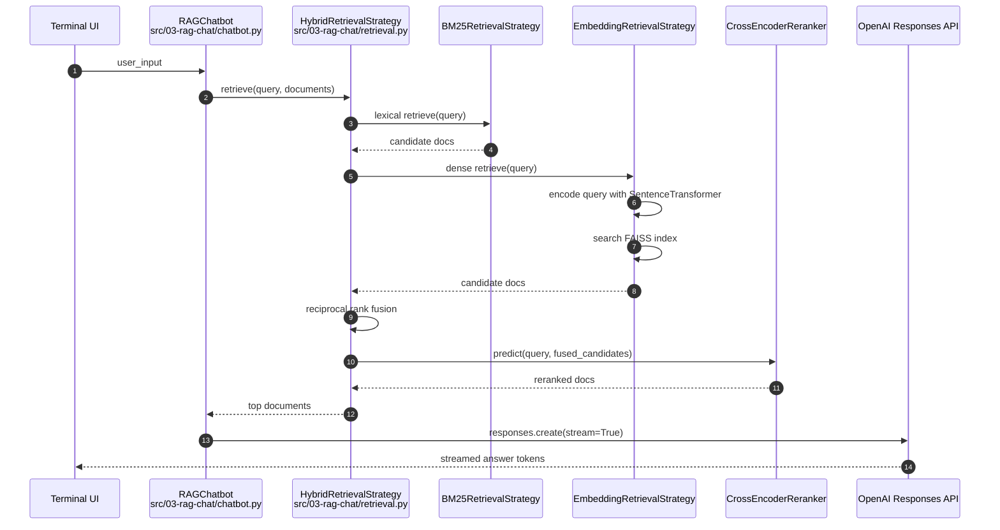

## Bottleneck Path Sequence (Mermaid)

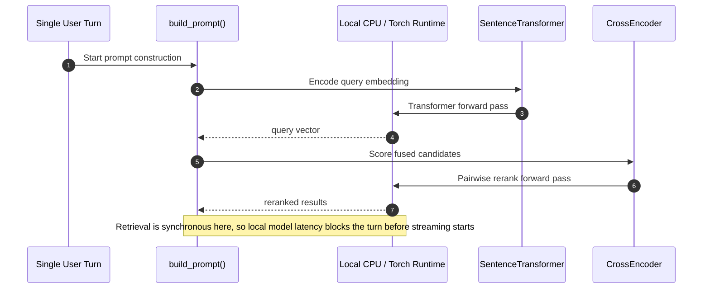

## Implementation Notes

- The app is only network-async for the OpenAI response stream. Retrieval still runs synchronously inside `RAGChatbot.build_prompt()` before `responses.create(...)` is called.
- `main.py` already performs the highest-value startup optimization for the current architecture: BM25 and FAISS indexes are built eagerly for `bm25`, `embedding`, and `hybrid`.
- For the current `hybrid` path, the dominant per-query costs are local model inference, not FAISS search:
  - `EmbeddingRetrievalStrategy.retrieve()` encodes the query on every turn.
  - `CrossEncoderReranker.rerank()` scores every fused candidate pair on every turn.
- `faiss.IndexFlatIP` is exact brute-force inner-product search. It is simple and correct for a small in-memory corpus, but it does not change the fact that embedding generation is the heavier step.
- The code recomputes serialized document snapshots repeatedly to detect corpus changes. That is not the top bottleneck today, but it becomes wasted work as document count grows.

## Key Bottlenecks

- `src/03-rag-chat/chatbot.py`: prompt construction blocks on retrieval before any token can stream to the terminal.
- `src/03-rag-chat/retrieval.py`: `SentenceTransformer.encode(...)` for the query is the primary dense-retrieval hot path cost.
- `src/03-rag-chat/retrieval.py`: `CrossEncoder.predict(...)` is the most expensive step in the hybrid path and usually the first place to cut latency.
- `src/03-rag-chat/retrieval.py`: repeated `_serialize_documents(documents)` calls add avoidable Python overhead and duplicate change-detection work.
- `src/03-rag-chat/retrieval.py`: `IndexFlatIP` scales linearly with corpus size, so approximate FAISS indexes matter only after the corpus is much larger than the current tutorial dataset.

## CPU-Bound Vs GPU-Accelerated Work

- GPU-accelerated:
  - `EmbeddingRetrievalStrategy.build_index()` during `SentenceTransformer.encode(...)` over the full corpus.
  - `EmbeddingRetrievalStrategy.retrieve()` during query embedding generation.
  - `CrossEncoderReranker.rerank()` during pairwise reranker inference.
- Why these benefit from GPU:
  - Both the bi-encoder and the cross-encoder are transformer forward passes with large dense matrix multiplications.
  - Those tensor operations parallelize well on GPU and are usually the dominant numeric workload in the current retrieval stack.
- Usually CPU-bound in the current code:
  - `TiktokenTokenizer` normalization and token cleanup.
  - BM25 tokenization and lexical retrieval.
  - Python-side document serialization, cache comparison, reciprocal rank fusion, sorting, and prompt assembly.
  - Small FAISS exact search on a tiny in-memory corpus.
- Why these stay CPU-bound:
  - They are mostly Python string processing, control flow, light numeric work, or small-data index operations.
  - Their latency is driven more by interpreter overhead and memory access than by large tensor math.
- Conditionally GPU-accelerated:
  - FAISS can use GPU indexes, but that only becomes meaningful when vector search itself is the bottleneck.
  - For this tutorial corpus, vector search is too small for GPU FAISS to matter much; query embedding and reranking dominate first.

## Hardware Guidance

- If a GPU is available, put `SentenceTransformer(model)` and `CrossEncoder(model)` on GPU first.
  - That accelerates the most expensive per-turn steps without changing retrieval behavior.
- If no GPU is available, optimize for CPU inference instead.
  - ONNX or OpenVINO backends and quantized CPU models are the highest-value path.
- Do not expect GPU to materially speed up BM25, token cleanup, prompt construction, or Python bookkeeping.
  - Those stages are not large batched tensor workloads.
- Consider GPU FAISS only after the corpus grows enough that nearest-neighbor search time is visible relative to embedding generation.
  - Right now, the app is model-inference-bound, not vector-search-bound.

## Complexity Analysis By Layer

- Notation:
  - `N`: number of documents
  - `S`: average serialized document size
  - `q`: query token count
  - `d`: embedding dimension
  - `m`: rerank candidate count
  - `k`: returned top-k

### `TiktokenTokenizer`

- Runtime shape:
  - `tokenize_to_sequence(text)`: roughly linear in input token count
  - `tokenize(text)`: same tokenization cost plus set construction
- Why:
  - The implementation decodes token ids one by one, normalizes strings, filters characters, and appends Python strings.
- Bound:
  - CPU-bound.
- Main cost drivers:
  - Python loops
  - per-token decode
  - string cleanup and allocation

### `KeywordRetrievalStrategy`

- Runtime shape:
  - warm path: query tokenization plus a linear scan over documents with set-intersection scoring
  - cold path: includes document tokenization on cache miss
- Approximate cost:
  - warm path: `O(q) + O(N * set-intersection)`
  - cold path: closer to `O(q) + O(N * S)`
- Bound:
  - CPU-bound.
- Why:
  - Document scoring is local Python set logic with no tensor acceleration path.

### `BM25RetrievalStrategy.build_index()`

- Runtime shape:
  - serialize the corpus
  - tokenize the corpus
  - build BM25 postings/statistics
- Approximate cost:
  - roughly linear in total corpus token count
- Bound:
  - CPU-bound.
- Why:
  - The expensive work is text processing and lexical index construction, not dense numeric compute.

### `BM25RetrievalStrategy.retrieve()`

- Runtime shape:
  - serialize documents again for change detection
  - compare current corpus snapshot against indexed snapshot
  - tokenize the query
  - run BM25 retrieval
- Approximate cost:
  - `O(N * S)` for corpus snapshot rebuild and comparison
  - plus lexical retrieval cost over postings
- Bound:
  - CPU-bound.
- Why:
  - The algorithm is dominated by Python/object work plus lexical matching.
- Important note:
  - In the current implementation, repeated `_serialize_documents(documents)` calls are a visible source of avoidable CPU work even before BM25 retrieval itself becomes expensive.

### `EmbeddingRetrievalStrategy.build_index()`

- Runtime shape:
  - serialize documents
  - embed all documents once
  - add vectors to FAISS
- Approximate cost:
  - `O(N * S)` for serialization
  - plus corpus embedding inference
  - plus roughly `O(N * d)` to add vectors
- Bound:
  - mixed:
    - serialization is CPU-bound
    - model inference is GPU-accelerated if available, otherwise CPU-bound
    - FAISS add is usually light compared with embedding inference for the current corpus
- Why:
  - Corpus embedding is transformer forward-pass work and is the main accelerator target.

### `EmbeddingRetrievalStrategy.retrieve()`

- Runtime shape:
  - rebuild serialized corpus snapshot
  - compare current and cached snapshots
  - encode the query once
  - search `IndexFlatIP`
  - filter the top results
- Approximate cost:
  - `O(N * S)` for snapshot rebuild and comparison
  - plus one query embedding pass
  - plus exact vector search of roughly `O(N * d)`
  - plus `O(k)` filtering
- Bound:
  - mixed:
    - snapshot rebuild/filtering are CPU-bound
    - query embedding is GPU-accelerated if available, otherwise CPU-bound
    - FAISS search can be CPU or GPU depending on index placement
- Important note:
  - For the current tiny tutorial corpus, query embedding is usually more expensive than exact FAISS search.
  - For larger corpora, `IndexFlatIP` search can eventually become a real bottleneck because it scales linearly with `N`.

### `CrossEncoderReranker.rerank()`

- Runtime shape:
  - build `(query, document)` input pairs for every candidate
  - run cross-encoder inference for each pair
  - sort by score
- Approximate cost:
  - `O(m * S)` to build input pairs
  - plus `m` cross-encoder forward passes
  - plus `O(m log m)` to sort scores
- Bound:
  - mixed, but dominated by model inference:
    - pair construction and sort are CPU-bound
    - `predict(pairs)` is GPU-accelerated if available, otherwise CPU-bound
- Why this is usually the most expensive step:
  - The embedding retriever encodes the query once and reuses cached document vectors.
  - The cross-encoder reprocesses the combined query-document text for every candidate on every query.
  - That repeated per-candidate transformer work is typically more expensive than one query embedding plus a small vector search.

### `HybridRetrievalStrategy.retrieve()`

- Runtime shape:
  - run BM25 retrieval
  - run dense retrieval
  - fuse rankings
  - rerank the fused candidates
- Approximate cost:
  - `T_hybrid = T_bm25 + T_dense + T_fusion + T_rerank`
- Bound:
  - mixed.
- Why:
  - lexical retrieval and fusion are CPU-bound
  - dense encoding and cross-encoder reranking are model-inference-bound
- Important note:
  - In practice, `T_rerank` is usually the dominant term once `m` is more than a few candidates.

### `RAGChatbot.build_prompt()`

- Runtime shape:
  - call retrieval synchronously
  - append retrieved context and chat history into a prompt string
- Approximate cost:
  - retrieval cost plus prompt assembly linear in the size of selected context and history
- Bound:
  - CPU-bound.
- Why:
  - The implementation is Python list building and string joining.
- Important note:
  - This layer is not numerically expensive, but it is latency-critical because no response token can stream until retrieval and prompt assembly finish.

## CPU-Bound Implementations In The Current Flow

- Fully CPU-bound:
  - `TiktokenTokenizer`
  - `KeywordRetrievalStrategy`
  - most of `BM25RetrievalStrategy`
  - `_serialize_documents(...)` and corpus snapshot comparisons
  - reciprocal-rank fusion in `HybridRetrievalStrategy`
  - Python-side sorting, filtering, and prompt construction
- Mixed but with CPU control-plane overhead:
  - `EmbeddingRetrievalStrategy`
  - `CrossEncoderReranker`
- Why these remain CPU-bound even when a GPU is available:
  - They are dominated by Python control flow, string processing, lexical statistics, or small object manipulation rather than large batched tensor math.

## Relative Cost Expectation For Current `hybrid` Mode

- Expected order for the current small-corpus tutorial app:
  1. `CrossEncoderReranker.rerank()`
  2. query embedding in `EmbeddingRetrievalStrategy.retrieve()`
  3. repeated corpus serialization and change detection
  4. BM25 retrieval
  5. reciprocal-rank fusion and prompt assembly
- Important caveat:
  - If the corpus grows substantially, exact `IndexFlatIP` search can move up the list.
  - For the current in-memory document set, transformer inference remains the more important latency source.

## Recommended Optimization Order

- First: keep the current architecture and optimize local model inference.
  - Prefer `sentence-transformers` backends such as ONNX or OpenVINO for both the embedding model and the cross-encoder.
  - If CPU-bound, quantized ONNX or OpenVINO is the first practical step.
- Second: make reranking optional or reduce the fused candidate count.
  - This preserves the tutorial comparison path while giving a clear latency-quality switch.
- Third: cache serialized retrieval text and any document-derived metadata once per corpus build.
  - This removes repeated Python work without changing ranking behavior.
- Fourth: move retrieval off the event loop boundary with `asyncio.to_thread(...)` only if terminal responsiveness matters.
  - This improves app responsiveness but does not make local inference itself faster.
- Fifth: switch FAISS from `IndexFlatIP` to an approximate index such as HNSW or IVF only when corpus size justifies it.
  - For the current tiny corpus, approximate indexing adds complexity without meaningful latency benefit.
- Sixth: consider Qdrant only when persistence, filtering, or concurrent multi-user serving becomes a requirement.
  - It is a storage and serving choice, not the first speed fix for this tutorial app.

## Rollout Notes

- The most defensible near-term change set is small:
  - add backend selection for sentence-transformer and cross-encoder loading
  - cache serialized documents once
  - add a reranker on/off switch or lower candidate fanout
- Parallel or async retrieval libraries are not the main answer for the current code path because the expensive stages are local transformer forward passes, not network I/O.

# Edit 6 Vanilla Agentic RAG 2026-04-22 18:39 Branch: feat/agent-rag

## Agentic RAG Request Sequence (Mermaid)

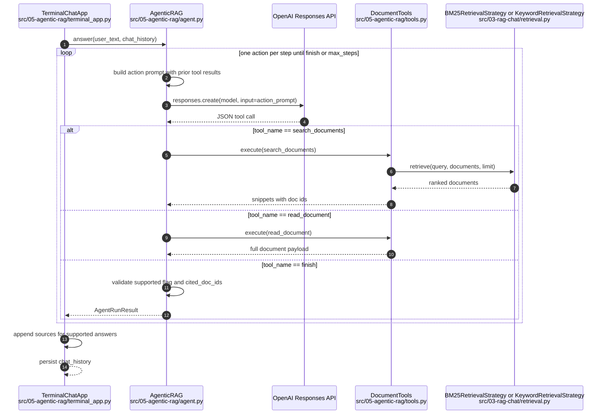

## Unsupported / Guardrail Sequence (Mermaid)

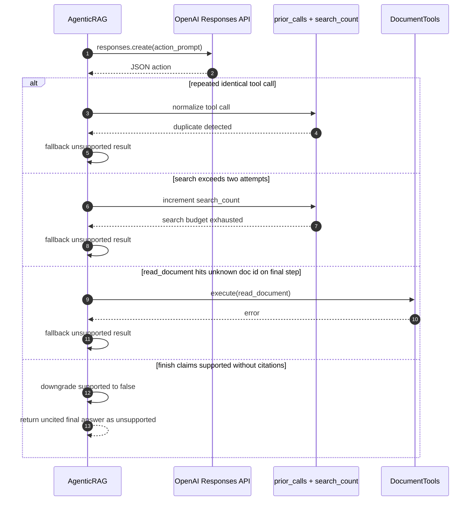

## Implementation Notes

- `src/05-agentic-rag/main.py` composes the new lesson while reusing the fixed corpus and lexical retrieval strategies from `src/03-rag-chat`.
- The import boundary is explicit and path-based:
  - local `05` modules win for `agent.py`, `models.py`, and `terminal_app.py`
  - `03` modules are loaded by file path for shared `data.py` and `retrieval.py`
- `src/05-agentic-rag/agent.py` is intentionally small but carries the full control-plane contract:
  - one JSON action per model call
  - bounded step budget
  - duplicate tool-call rejection
  - maximum two searches per user turn
  - finish-result validation before returning to the terminal app
- `src/05-agentic-rag/tools.py` keeps the tool surface minimal:
  - `search_documents(...)` for ranked snippets
  - `read_document(...)` for full-document inspection
- `finish(...)` is modeled as a structured action rather than an executable tool. That keeps the stop condition visible in the controller loop and avoids hiding final-answer validation in the tool layer.
- `src/05-agentic-rag/terminal_app.py` appends `Sources: ...` only for supported answers with citations, then stores the rendered assistant text in chat history.

## Rollout Notes

- This lesson is intentionally narrower than the existing hybrid retrieval work:
  - no reranker
  - no vector-store abstraction
  - no eval harness inside the lesson
  - no external tool backends
- The main teaching goal is to isolate the first agentic transition:
  - from fixed retrieval pipeline
  - to bounded tool-selection loop
- The adjacent local README in `src/05-agentic-rag/README.md` mirrors this architecture-dump structure so the lesson can be read in isolation without opening the repo-root architecture log first.
