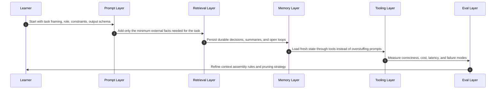
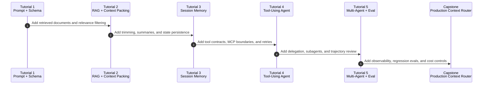
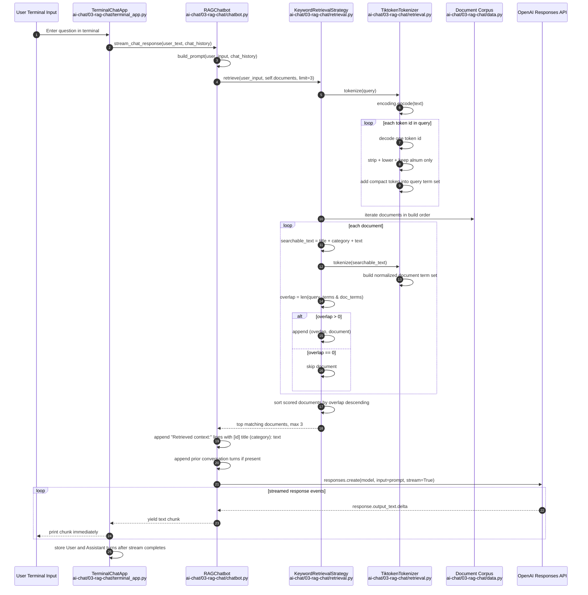
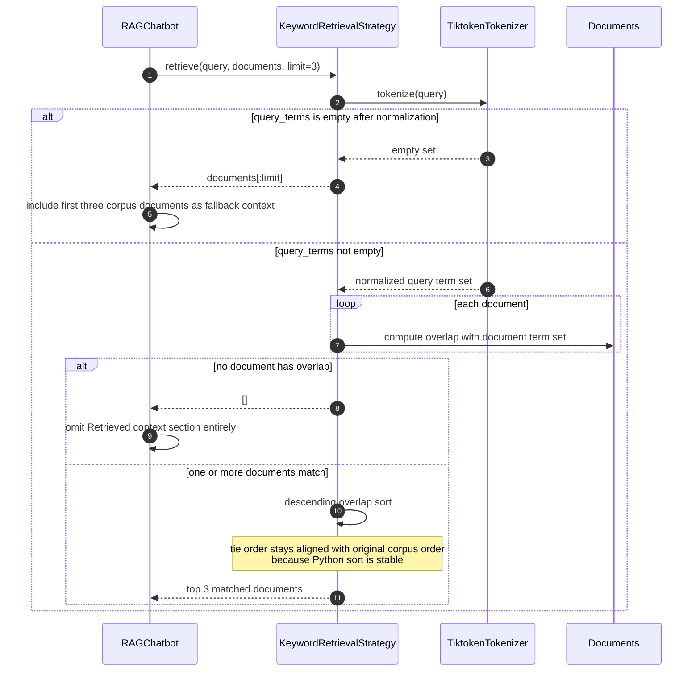

# Edit 1 Context Engineering Tutorial Plan 2026-04-18 15:23 Branch: no-git

## Context Engineering Learning Sequence (Mermaid)

## Tutorial Build Ladder Sequence (Mermaid)

## Implementation Notes

- Goal: learn context engineering as a systems discipline, not a prompt-writing trick.
- Recommended order: `prompting -> retrieval -> memory -> tools -> orchestration -> evals -> production optimization`.
- Success criterion: by the capstone, the system should reliably decide what to put in context, what to fetch just-in-time, what to summarize, and what to keep outside the context window.

## Core Concepts To Learn

### 1. Context Assembly

- System prompts, task prompts, examples, structured outputs, and guardrails.
- The main skill is selecting the smallest high-signal token set for the next step.
- Learn failure modes: vague prompts, contradictory instructions, stale retrieved context, and oversized tool schemas.

### 2. Retrieval And Context Packing

- Query rewriting, chunking, reranking, top-k selection, citation grounding, and source trust.
- Learn to treat RAG as one input channel, not the whole architecture.
- Practice packing retrieved evidence near the decision point rather than dumping long documents into the window.

### 3. Short-Term Memory

- Conversation state, turn windows, trimming, compaction, and summaries.
- Learn when to keep raw turns, when to compress, and when to restart the working context.
- Practice preserving exact recent turns while summarizing older decisions and open issues.

### 4. Long-Term Memory

- Durable notes, task state, user preferences, working files, and project memory.
- Learn the split between ephemeral working memory and persistent external memory.
- Practice explicit write/read rules so the agent does not pollute memory with low-value observations.

### 5. Tool And Protocol Design

- Function calling, tool contracts, MCP servers, permissions, retries, and tool-result pruning.
- Learn to expose narrow tools with clear decision boundaries.
- Practice just-in-time loading of data via tools rather than front-loading everything into prompts.

### 6. Agent Orchestration

- Single-agent loops, planner/executor splits, reviewer loops, and subagents.
- Learn when multi-agent designs reduce context load versus when they only add coordination overhead.
- Practice returning distilled summaries from workers back to a lead agent.

### 7. Evaluation

- Task-level correctness, citation quality, retrieval recall, tool success rate, latency, and token cost.
- Learn trajectory review: not only whether the final answer was correct, but whether the context path was efficient and robust.
- Practice building regression suites for context failures, not only output failures.

### 8. Production Optimization

- Prompt caching, context-window budgeting, streaming, observability, and safety controls.
- Learn that larger context windows reduce pressure but do not remove the need for pruning and relevance control.
- Practice building cost-aware policies for retrieval, memory reads, and compaction frequency.

## State Of The Art To Internalize (Post-2025)

### A. Context Engineering Replaced Pure Prompt Tuning

- Anthropic's September 29, 2025 engineering post is the clearest recent statement of the shift: context engineering is about curating the full token state available to the model, not only writing prompts.
- The important mental model is finite attention budget. More tokens can degrade recall and focus, so relevance beats volume.

### B. Just-In-Time Context Is Winning Over Naive Preloading

- Current agent guidance has shifted toward keeping lightweight references in memory and loading real data at runtime through tools.
- This enables progressive disclosure: the agent inspects the environment, loads only the useful slices, and keeps the working set small.

### C. Compaction And Memory Are First-Class

- The strongest post-2025 pattern is explicit context management: trim recent turns, summarize old turns, persist notes externally, and clear stale tool output.
- Short-term memory management is now documented as an engineering surface, not an implementation detail.

### D. Bigger Windows Help, But Do Not Remove Context Engineering

- Frontier systems now expose very large windows, but recent guidance still emphasizes compaction, note-taking, and pruning because context quality degrades when the window is stuffed.
- Context awareness and token-budget awareness improve execution, but they do not replace architecture work.

### E. Protocol Standardization Matters

- MCP is becoming a practical interoperability layer for connecting agents to tools, data, and workflows.
- You should treat protocol design as part of context engineering because the protocol determines what can be fetched, when, and at what granularity.

### F. Evals And Observability Are Part Of The Core Stack

- Modern agent stacks now ship with explicit tracing and evaluation paths.
- If you cannot inspect retrieval decisions, tool calls, summaries, and state transitions, you cannot improve the context policy with confidence.

## Core Libraries / Frameworks To Know

### Foundational APIs

- `OpenAI Responses API + Agents SDK`
  - Learn for: stateful conversations, tools, built-in file search/web search, compaction, prompt caching, and agent evaluation loops.
  - Use when: you want a modern first-party stack with strong tool support and direct context-management primitives.

- `Anthropic Claude API + memory/context guidance`
  - Learn for: context engineering mental models, memory patterns, tool design, and long-horizon task techniques.
  - Use when: you want the clearest recent applied guidance on compaction, note-taking, and subagent context isolation.

### Interoperability Layer

- `Model Context Protocol (MCP)`
  - Learn for: standardizing external tools, data sources, and reusable skills.
  - Use when: you want agents to fetch context from heterogeneous systems without custom one-off integrations everywhere.

### Python Orchestration

- `LangGraph`
  - Learn for: durable execution, stateful long-running agents, human-in-the-loop control, and production orchestration.
  - Best tutorial fit: implement planner/executor/reviewer graphs and inspect traces.

- `PydanticAI`
  - Learn for: typed agents, structured IO, dependency injection, and production-grade Python ergonomics.
  - Best tutorial fit: build smaller strongly-typed systems before moving to heavier orchestration.

- `DSPy`
  - Learn for: declarative LM programs, optimization, signatures, and eval-driven prompt/module tuning.
  - Best tutorial fit: learn how to optimize context strategies and modules systematically instead of hand-tweaking prompts.

- `LlamaIndex`
  - Learn for: knowledge-heavy systems, retrieval pipelines, workflows, and agentic RAG.
  - Best tutorial fit: build retrieval-centric assistants where data connectors and workflow composition matter.

### TypeScript Product Layer

- `Vercel AI SDK`
  - Learn for: shipping chat/product interfaces, provider abstraction, tool usage, message persistence, telemetry, and generative UI patterns.
  - Best tutorial fit: frontend or full-stack context-engineering demos where UX and streaming matter.

### Observability / Eval Adjacency

- `LangSmith`
  - Learn for: trace inspection, evaluation, and production debugging of agent workflows.
  - Best tutorial fit: compare alternative context policies on the same task set.

## Tutorials To Do

### Tutorial 1: Prompt Contract And Output Control

- Build a single-call assistant with strong system instructions, explicit constraints, and structured JSON output.
- Learn:
  - instruction hierarchy
  - schema-first outputs
  - example selection
  - refusal and fallback design
- Deliverable:
  - one API route
  - one eval set of 20 inputs
  - one failure log with prompt revisions

### Tutorial 2: Retrieval And Context Packing

- Build a document QA assistant over a small corpus.
- Learn:
  - chunking
  - top-k retrieval
  - reranking
  - citation grounding
  - packing only the evidence needed for the question
- Deliverable:
  - retrieval pipeline
  - citation-aware answer formatter
  - evals for false citations, missed evidence, and irrelevant context

### Tutorial 3: Session Memory And Compaction

- Build a multi-turn assistant that trims old turns, summarizes older state, and persists durable notes.
- Learn:
  - recent-turn retention
  - summary prompts
  - durable session memory
  - replay vs summary tradeoffs
- Deliverable:
  - memory policy document
  - session store
  - tests for memory drift and summary omission

### Tutorial 4: Tool-Using Agent With MCP

- Build an agent that can read local docs, query a simple database, and call at least one external tool through MCP or an equivalent tool interface.
- Learn:
  - tool schema design
  - permissions
  - retries
  - tool-result pruning
  - just-in-time loading
- Deliverable:
  - 3 to 5 tools
  - trace logs
  - failure cases for wrong tool choice and oversized tool outputs

### Tutorial 5: Multi-Agent Research Workflow

- Build a lead agent that delegates retrieval or analysis to focused subagents and receives compressed summaries back.
- Learn:
  - decomposition
  - summary contracts
  - context isolation
  - reviewer loops
  - parallel search vs unnecessary agent sprawl
- Deliverable:
  - planner
  - 2 workers
  - reviewer
  - eval showing when multi-agent improves quality or speed

### Tutorial 6: Capstone Production Context Router

- Build an app that decides per request which context sources to load: prompt template, memory, retrieval, tool output, or human escalation.
- Learn:
  - policy routing
  - token budgeting
  - caching
  - tracing
  - cost/latency tradeoffs
- Deliverable:
  - routing policy
  - live traces
  - regression suite
  - dashboard for quality, cost, and latency

## Suggested Learning Order

### Week 1

- Learn prompt contracts and structured outputs.
- Finish Tutorial 1.

### Week 2

- Learn retrieval, ranking, and evidence packing.
- Finish Tutorial 2.

### Week 3

- Learn short-term memory, summaries, and compaction.
- Finish Tutorial 3.

### Week 4

- Learn tool design and MCP.
- Finish Tutorial 4.

### Week 5

- Learn orchestration patterns and subagents.
- Finish Tutorial 5.

### Week 6

- Learn tracing, evals, and cost control.
- Finish Tutorial 6.

## Research Basis

- Anthropic, `Effective context engineering for AI agents`, published September 29, 2025, should be treated as the primary conceptual source.
- OpenAI API guides on `Agents`, `Agents SDK`, `Using tools`, `Conversation state`, `Prompt caching`, and `Agent evals` should be treated as the primary implementation sources.
- MCP docs and specification revisions from 2025 should be treated as the primary protocol sources.
- Framework docs should be learned by layer rather than memorized all at once:
  - orchestration: `LangGraph`
  - typed Python agents: `PydanticAI`
  - optimization and eval-driven tuning: `DSPy`
  - retrieval-heavy workflows: `LlamaIndex`
  - product UI delivery: `Vercel AI SDK`

## Rollout Notes

- Start in Python unless your main target is frontend product work, in which case pair Python backends with `Vercel AI SDK` on the UI side.
- Do not start with multi-agent systems. Earn them by first making single-agent context assembly reliable.
- Treat every tutorial as an eval project. If a tutorial does not produce trace data and failure cases, it is incomplete.

# Edit 2 AI Chat 03 RAG Chat 2026-04-19 11:42 Branch: main

## Terminal RAG Chat Request Sequence (Mermaid)

## Retrieval Edge Cases Sequence (Mermaid)

## Implementation Notes

- Composition root: `main.py` wires `Settings`, `AsyncOpenAI`, `TiktokenTokenizer`, `KeywordRetrievalStrategy`, `RAGChatbot`, and `TerminalChatApp`.
- Corpus construction is static. `data.py` converts `RAW_DOCUMENTS` into immutable `Document` dataclass instances once during startup.
- Retrieval is purely lexical. There is no embedding index, vector store, reranker, or persistence layer in this tutorial.
- `TiktokenTokenizer.tokenize()` produces a `set[str]` of normalized terms, not an ordered token stream. Duplicate terms are intentionally collapsed before scoring.
- Normalization in `retrieval.py` is strict:
  - token ids come from `tiktoken.encoding_for_model(model)` with fallback to `o200k_base`
  - each token id is decoded individually
  - whitespace is stripped
  - text is lowercased
  - non-alphanumeric characters are removed
  - empty results are discarded
- Document scoring is simple set intersection. A document score is the count of unique normalized terms shared by query and document, not frequency-weighted relevance.
- Document text used for retrieval is assembled from `title`, `category`, and `text`. This means category labels such as `hr` or `security` can directly influence ranking.
- Matching documents are stored as `(overlap, document)` tuples, sorted in descending score order, and truncated to `limit=3`.
- Tie behavior is deterministic relative to corpus order because the sort key only uses overlap and Python sorting is stable.
- Prompt construction is additive:
  - start with the system prompt
  - add retrieved document bullets only if retrieval returns at least one document
  - add full chat history if present
  - append the current `User:` turn and final `Assistant:` cue
- The chat loop keeps conversation history only in process memory inside `TerminalChatApp.chat_history`. Restarting the process drops prior turns.
- Streaming is one-way from the OpenAI Responses API into the terminal. The assistant response is buffered locally only so the completed answer can be stored back into chat history after printing.

## Retrieval Notes

- The retrieval fallback is asymmetric:
  - empty normalized query returns the first three documents
  - non-empty query with zero matches returns no documents
- That asymmetry means punctuation-only or otherwise non-alphanumeric queries still inject default context into the prompt, while specific unmatched queries do not.
- Because scoring is based on unique-term overlap, repeated words in a document do not increase its rank.
- Because each document is retokenized on every user turn, retrieval cost scales linearly with both corpus size and document length for every prompt build.
