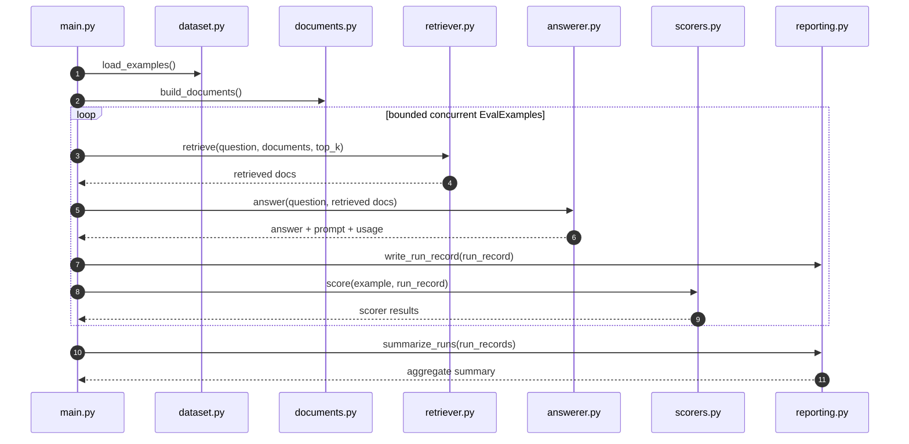

# 04 Minimal Evals Exercise

This folder is the smallest useful eval harness in the repo:

- `dataset.py`: hand-written JSONL examples
- `documents.py`: fixed source corpus
- `retriever.py`: retrieval component eval seam
- `answerer.py`: prompt + model seam
- `scorers.py`: deterministic evals first, judge evals later
- `reporting.py`: local structured run logs and summaries
- `main.py`: one-shot batch script, not a chat loop

## Flow

The current `04` exercise runs in this order:

1. Load local settings and the hand-written dataset.
2. Load the fixed document corpus.
3. Retrieve top-k documents for each question.
4. Build a prompt from `question + retrieved docs`.
5. Generate an answer with the OpenAI answerer.
6. Save a structured `RunRecord`.
7. Score the run with deterministic evals first.
8. Print a summary report across all examples.

This is intentionally simple. It gives you one clean pipeline:

`dataset -> retrieval -> prompt assembly -> answer -> run record -> scoring -> report`

## Sequence Diagram




Suggested exercise order:

1. Inspect `GoldDocHitAtKScorer`.
2. Add one more deterministic retrieval or answer scorer.
3. Run prompt experiments against the OpenAI answerer.
4. Add one judge-based groundedness scorer.
5. Export the run records into your preferred eval backend.

# Eval Datasets and Scopes:

To operationalize the frameworks from **Jason Liu** (Tier 2 Relationships) and **Eugene Yan** (Practical RAG Patterns), you need datasets that go beyond simple "Question-Answer" pairs. You need "Question-Context-Answer" triplets.

Here is a breakdown of canonical datasets on Hugging Face mapped to Liu's **Tier 2 RAG Relationships** and the prioritization of **Patents** for these evals.

---

## 1 Mapping Hugging Face Datasets to Tier 2 Evals

Jason Liu’s Tier 2 focuses on the relationship between Question ($Q$), Context ($C$), and Answer ($A$).


| Tier 2 Relationship             | Definition                                              | Recommended HF Datasets                                                                                                                                                                                                                                                                                                    |
| ------------------------------- | ------------------------------------------------------- | -------------------------------------------------------------------------------------------------------------------------------------------------------------------------------------------------------------------------------------------------------------------------------------------------------------------------- |
| **Context Relevance ($C | Q$)** | Does the retrieved chunk actually answer the query?     | **[MS MARCO](https://huggingface.co/datasets/microsoft/ms_marco)** (v2.1): The gold standard for passage ranking and relevance. **[Natural Questions (NQ)](https://www.google.com/search?q=https://huggingface.co/datasets/google-ads-nq)**: Real Google searches mapped to Wikipedia passages.                            |
| **Faithfulness ($A | C$)**      | Is the answer grounded *only* in the retrieved context? | **[HaluEval](https://www.google.com/search?q=https://huggingface.co/datasets/pwenhu/HaluEval)**: Specifically designed to detect hallucinations in RAG outputs. **[FEVER](https://www.google.com/search?q=https://huggingface.co/datasets/fever)**: Fact extraction and verification dataset.                              |
| **Answer Relevance ($A | Q$)**  | Does the answer address the user's intent?              | **[HotpotQA](https://www.google.com/search?q=https://huggingface.co/datasets/hotpot_qa)**: Requires multi-hop reasoning; if the answer is relevant to the question but misses a "hop," it fails. **[SQuAD v2.0](https://huggingface.co/datasets/rajpurkar/squad_v2)**: Crucial because it includes unanswerable questions. |


---

## 2 Patent RAG Evaluation (The "High-Stakes" Tier)

Patents are the "Final Boss" of RAG because of their legal density and structural complexity. If you are prioritizing patents, you should focus on **Faithfulness ($A  C$)**—a hallucination in a patent search can lead to a multi-million dollar infringement oversight.

### Canonical Patent Datasets

- **[Hupd (Harvard USPTO Patent Dataset)](https://huggingface.co/datasets/HUPD/hupd):** The most comprehensive collection on HF. It contains over 7 million patent documents.
- **[PatentMatch](https://www.google.com/search?q=https://huggingface.co/datasets/TUWien/PatentMatch):** Ideal for **Context Relevance ($C  Q$)**. It specifically evaluates whether a patent claim matches a given technical description (prior art).

### Why Prioritize Patents?

If you use Eugene Yan’s "Evals first" pattern, patents provide a unique stress test for:

1. **Long-context Retrieval:** Patent claims are often buried in 50+ pages of legalese.
2. **Precision requirements:** Unlike a chatbot recommending a movie, patent RAG requires **100% Groundedness**.
3. **Evaluated Status:** Most of these are "pre-evaluated" in the sense that they have leaderboards on **PapersWithCode**, but for your custom RAG, you should run them through a **LLM-as-a-Judge** (using RAGAS or Arize Phoenix) to get your baseline.

---

## 3 Implementation Strategy (The Eugene Yan Approach)

Eugene Yan emphasizes building an **Eval Flywheel**. Instead of just downloading a dataset, you should:

1. **Start with Synthetic Evals:** Use the **[Hugging Face RAG Cookbook](https://huggingface.co/learn/cookbook/rag_evaluation)** method. Use a "Generator LLM" to create $(Q, C, A)$ triplets from your specific patent PDFs.
2. **Unit Tests for RAG:** Don't just measure "accuracy." Measure **"Recall at K"** for your retriever and **"Faithfulness"** for your generator separately.
3. **Human-in-the-loop:** For patents, use the **[Argilla](https://huggingface.co/argilla)** tool on Hugging Face to have a domain expert (patent attorney/agent) verify a small "Golden Set" of 50 samples.

> **Expert Tip:** If you are working with patents, prioritize **[RAGAS](https://www.google.com/search?q=https://github.com/explodinggradients/ragas)** metrics. It is the industry standard for calculating Liu's Tier 2 relationships ($C  Q, A  C, A  Q$) programmatically using Hugging Face models as the underlying judges.

Would you like a Python snippet showing how to load one of these patent datasets and format it for a RAGAS evaluation?

By the way, to unlock the full functionality of all Apps, enable [Gemini Apps Activity](https://myactivity.google.com/product/gemini).


# Sample Eval Hugging face light eval harness:

Inspiration from Huggingface LightEval:
``` https://github.com/huggingface/lighteval.git ```


## Inputs:

### Multiple tasks with reasoning tag removal  

```
lighteval vllm \  

    "model_name=mistralai/Magistral-Small-2507,dtype=float16,data_parallel_size=4" \  

    aime24 \  

    --remove-reasoning-tags \  

    --reasoning-tags="[('[THINK]','[/THINK]')]"  
    ```


## Eval Pipeline consrunction Design:

1. [Lighteval Pipeline Class](https://github.com/huggingface/lighteval/blob/6496d623/src/lighteval/pipeline.py#L70-L78)
```
class Pipeline:
    def __init__(
        self,
        tasks: str,
        pipeline_parameters: PipelineParameters,
        evaluation_tracker: EvaluationTracker,
        model_config: ModelConfig | None = None,
        model=None,
        metric_options=None,
```
