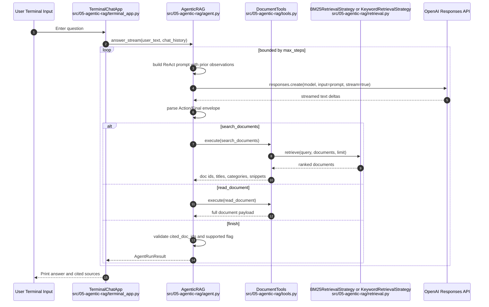
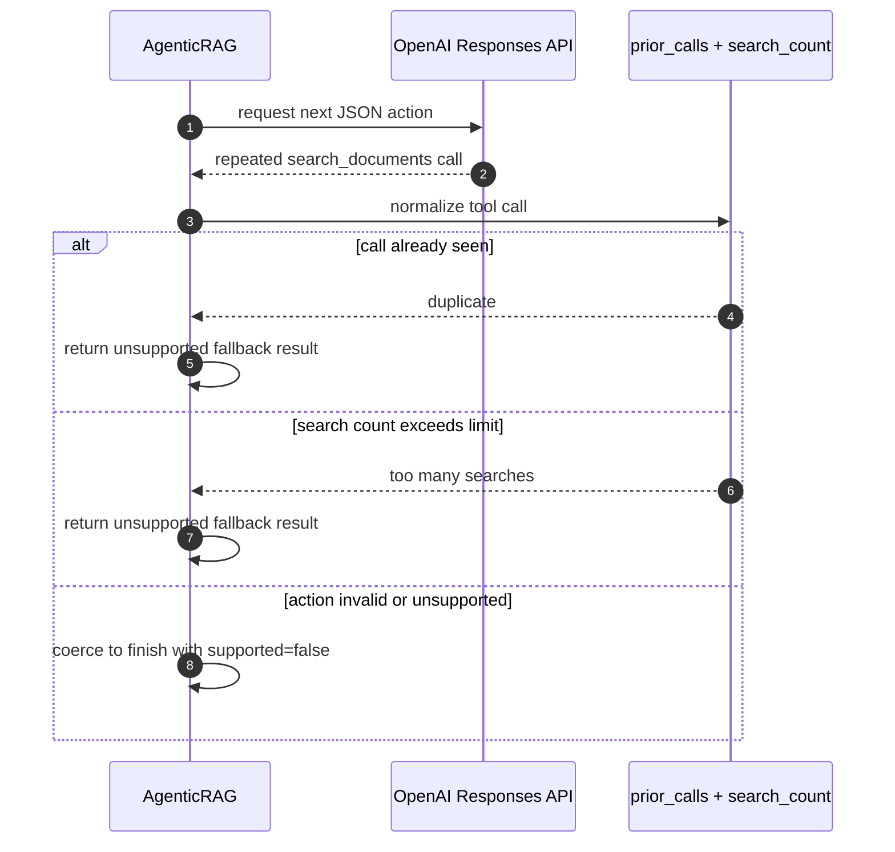

# 05 Vanilla Agentic RAG

This module is the smallest step from `03-rag-chat` into agentic RAG. Using ReAct loop.

The earlier `03` flow always retrieves first, then prompts the model with fixed context.
This `05` flow lets the model choose the next action inside a bounded loop:

- search document snippets
- read one full document
- finish with a grounded answer
- finish with an unsupported answer when evidence is weak

The implementation stays local and readable:

- fixed in-memory documents inside this section
- local BM25 or keyword retrieval inside this section
- one synchronous controller loop with streamed step events
- no hosted tools
- no vector store service
- no eval harness inside this lesson

## Agentic RAG Request Sequence (Mermaid)




## Duplicate Call / Weak Evidence Sequence (Mermaid)




## Implementation Notes

- `main.py` is self-contained inside `05` and wires only local `data.py`, `retrieval.py`, `agent.py`, and `terminal_app.py`.
- `agent.py` is the control plane. It owns:
  - the bounded step loop
  - ReAct action/final prompt and parsing
  - streamed per-step model deltas
  - duplicate-call prevention
  - search retry limits
  - final answer validation
- `tools.py` is the tool boundary. It only exposes:
  - `search_documents(query, limit)`
  - `read_document(doc_id)`
- `search_documents(...)` returns compact snippets first so the model can decide whether it needs a full document read.
- `Final: {...}` is not a real tool implementation. It is a structured stop signal interpreted inside `agent.py`.
- A supported answer is downgraded to unsupported if it does not include at least one cited document id.
- The chat loop remains synchronous in `terminal_app.py`, and now prints each streamed step output plus action/observation logs.

## Run Notes

Run the lesson from the repo root:

```bash
make run-agentic-rag
```

Optional flags:

```bash
uv run src/05-agentic-rag/main.py --strategy keyword --max-steps 4
```

Defaults:

- retrieval strategy: `bm25`
- step budget: `4`
- answer style: grounded with doc-id citations when supported

