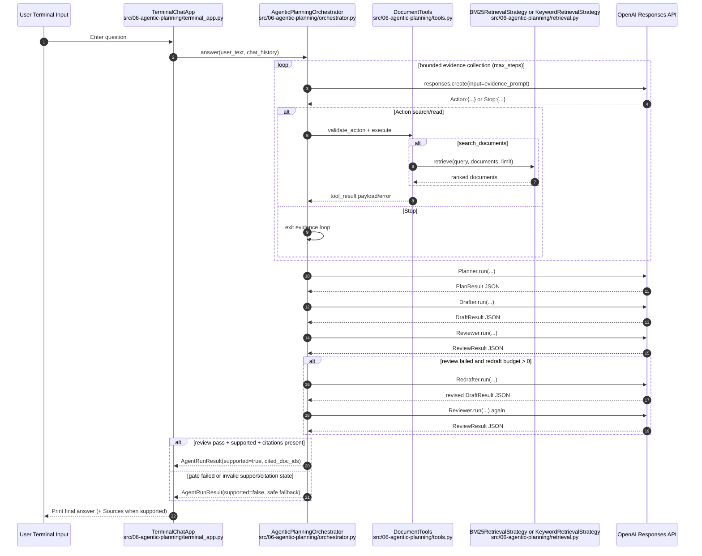
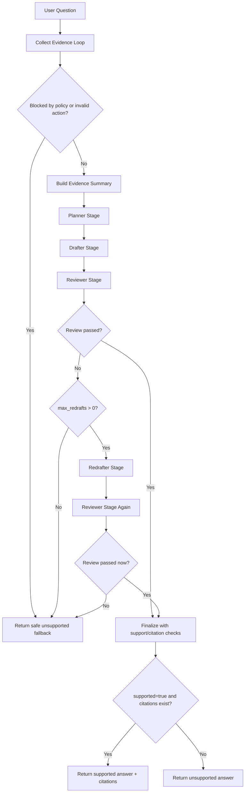

# 06 Agentic Planning

This module rebuilds agentic orchestration as a standalone planning pipeline.

Unlike `05`, which is primarily a ReAct-style tool loop, `06` separates the answer phase into explicit stages:

- planner
- drafter
- reviewer
- redrafter (bounded to one pass in MVP)
- reviewer-gated finalization

The flow keeps grounded retrieval local and deterministic, and returns a safe fallback when review still fails.

## Agentic Planning Request Sequence (Mermaid)



## Evidence Loop Deep Sequence (Mermaid)

This is the internal depth of `answer() -> _collect_evidence()` down to prompt construction, parse/validation, policy gating, and tool execution.

```mermaid
sequenceDiagram
    autonumber
    participant Orch as AgenticPlanningOrchestrator.answer
    participant Loop as _collect_evidence
    participant Decide as _decide_next_action
    participant Build as _build_action_prompt
    participant API as OpenAI Responses API
    participant Parse as _parse_decision
    participant Extract as _extract_json_object
    participant Tools as DocumentTools
    participant Validate as validate_action
    participant Policy as _should_block_tool_call
    participant Norm as _normalize_tool_call
    participant Exec as execute
    participant Search as _run_search_documents
    participant Read as _run_read_document
    participant Retriever as retrieval_strategy.retrieve
    participant Record as _record_call_outcome
    participant Summary as _build_evidence_summary

    Orch->>Loop: _collect_evidence(user_input, chat_history)
    loop for step_index in 1..max_steps
        Loop->>Decide: _decide_next_action(...)
        Decide->>Build: _build_action_prompt(...)
        Note over Build: Includes:\n- EVIDENCE_SYSTEM_PROMPT\n- list_tool_prompt_schemas()\n- policy rules text\n- remaining_steps\n- last 6 chat messages\n- previous tool results JSON
        Decide->>API: responses.create(model, input=prompt)
        API-->>Decide: output_text
        Decide->>Parse: _parse_decision(output_text)
        Parse->>Extract: _extract_json_object(...)
        alt StopDecision
            Parse-->>Loop: StopDecision(reason)
            Loop-->>Orch: (steps, blocked=false)
        else ActionDecision
            Parse-->>Loop: ActionDecision(tool_name, arguments)
            Loop->>Tools: validate_action(tool_name, arguments)
            Tools->>Validate: _validate_*_args(...)
            alt invalid args / unsupported tool
                Tools-->>Loop: ValueError
                Loop-->>Orch: (steps, blocked=true)
            else valid ToolCall
                Tools-->>Loop: ToolCall
                Loop->>Policy: _should_block_tool_call(tool_call, policy_state)
                Policy->>Norm: _normalize_tool_call(tool_call)
                Note over Policy: Policy checks:\n- duplicate_strategy\n- prior_call_errors\n- max_search_calls
                alt blocked by policy
                    Policy-->>Loop: true
                    Loop-->>Orch: (steps, blocked=true)
                else allowed
                    Policy-->>Loop: false
                    Loop->>Tools: execute(tool_call)
                    alt search_documents
                        Tools->>Exec: dispatch by tool_name
                        Exec->>Search: _run_search_documents(query, limit)
                        Search->>Retriever: retrieve(query, documents, limit)
                        Retriever-->>Search: ranked docs
                        Search-->>Loop: ToolResult(payload results)
                    else read_document
                        Tools->>Exec: dispatch by tool_name
                        Exec->>Read: _run_read_document(doc_id)
                        Read-->>Loop: ToolResult(payload text or error)
                    end
                    Loop->>Record: _record_call_outcome(tool_call, error, policy_state)
                end
            end
        end
    end
    Loop-->>Orch: (steps, blocked=false) on max_steps reached
    Orch->>Summary: _build_evidence_summary(steps)
```

## Agentic Planning Control Flow (Mermaid)



## Module Layout

- `main.py`: CLI composition and dependency wiring
- `orchestrator.py`: control plane and stage orchestration
- `stages.py`: planner/drafter/reviewer/redrafter stage implementations
- `tools.py`: retrieval tool boundary (`search_documents`, `read_document`)
- `retrieval.py`: local BM25 + keyword retrieval strategies
- `data.py`: fixed in-memory policy corpus
- `models.py`: typed contracts for stage outputs and final result
- `terminal_app.py`: synchronous terminal UX loop

## Design Decisions

1. Two-level control plane (`_collect_evidence` then plan/draft/review stages)
- Keeps retrieval-time failure modes isolated from language-generation stages.
- Enables deterministic block/fallback behavior before expensive drafting.

2. Prompt construction is explicit and append-only (`_build_action_prompt`)
- Guarantees each decision sees the same structured context shape.
- Makes policy behavior auditable from serialized prior tool results.

3. Action parsing is resilient (`_parse_decision` + `_extract_json_object`)
- Accepts mildly noisy model output (including fenced blocks) without crashing loop control.
- Converts malformed output into safe stop/block paths instead of undefined behavior.

4. Tool registration is table-driven (`ToolSpec` registry)
- `name`, `prompt_schema`, `validator_name`, `executor_name` are defined in one place.
- Adding a tool requires one registry entry + validator/executor methods, minimizing wiring drift.

5. Validation is separated from execution (`validate_action` vs `execute`)
- Prevents executor code from handling schema normalization concerns.
- Produces normalized `ToolCall` objects for policy checks and dedupe.

6. Duplicate and depth controls are stateful policy checks (`_should_block_tool_call`)
- Duplicate call policy (`retry_on_error_only`/`always_block`) avoids unproductive loops.
- `max_search_calls` bounds retrieval fan-out and keeps evidence collection cost predictable.

7. Canonical call fingerprinting (`_normalize_tool_call`)
- Stable JSON normalization gives reliable per-call dedupe keys.
- Avoids false misses from argument key ordering differences.

8. Outcome memory is minimal but sufficient (`_record_call_outcome`)
- Tracks counts and last error status only; no large payload retained in policy state.
- Enables retry-on-error semantics without overcomplicating policy logic.

9. Finalization is reviewer-gated and citation-gated (`_finalize_result`)
- Prevents unsupported answers from being marked supported.
- Falls back safely when review fails or citations are missing.

## Run Notes

Run from repo root:

```bash
make run-agentic-planning
```

Optional flags:

```bash
uv run src/06-agentic-planning/main.py --strategy keyword --max-steps 4 --max-redrafts 1
```

Defaults:

- retrieval strategy: `bm25`
- evidence step budget: `4`
- redraft budget: `1` (MVP hard cap)
