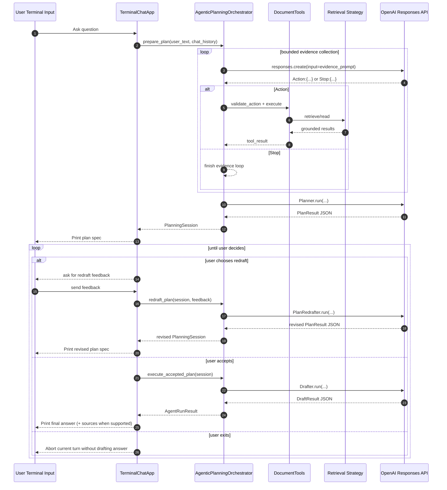

# 06 Agentic Planning

This module now uses a user-visible planning loop instead of an internal reviewer/redrafter answer loop.

Flow per turn:

1. Collect evidence with the bounded tool loop.
2. Draft a plan spec from that evidence.
3. Show the plan spec to the user.
4. Stay in the plan loop until the user:
   - chooses `accept`
   - chooses `redraft`, then gives feedback
   - exits the plan loop
5. If accepted, execute the accepted plan immediately and print the grounded answer.

## Request Sequence

## Module Layout

- `main.py`: CLI wiring
- `orchestrator.py`: evidence collection plus `prepare_plan`, `redraft_plan`, `execute_accepted_plan`
- `stages.py`: planner, user-feedback plan redrafter, and final drafter
- `tools.py`: retrieval tool boundary
- `models.py`: planning session, plan, and final answer contracts
- `terminal_app.py`: explicit terminal-managed plan loop

## Notes

- Evidence is collected once per planning session and reused across plan redrafts.
- After a plan is shown, the terminal app requires an explicit `accept`, `redraft`, or `exit plan` choice before it interprets free-form text.
- Supported answers still require citations.
- `--max-redrafts` has been removed; the user controls the loop explicitly.
