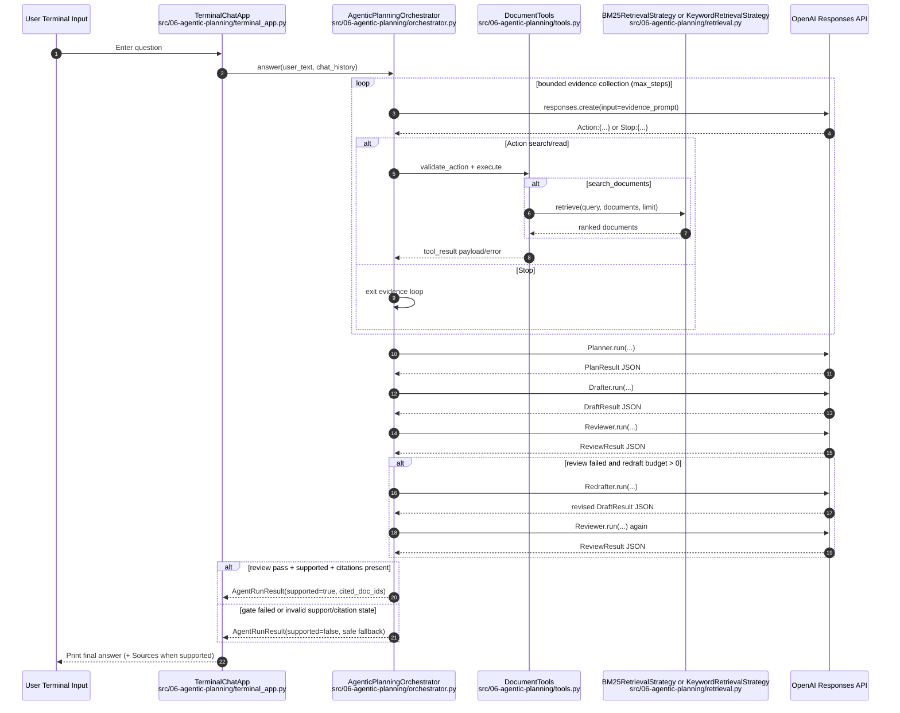
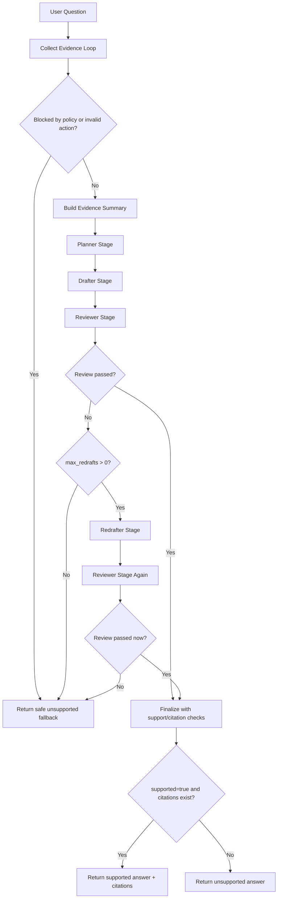

# 06 Agentic Planning

This module rebuilds agentic orchestration as a standalone planning pipeline.

Unlike `05`, which is primarily a ReAct-style tool loop, `06` separates the answer phase into explicit stages:

- planner
- drafter
- reviewer
- redrafter (bounded to one pass in MVP)
- reviewer-gated finalization

The flow keeps grounded retrieval local and deterministic, and returns a safe fallback when review still fails.

## Agentic Planning Request Sequence (Mermaid)



## Agentic Planning Control Flow (Mermaid)



## Module Layout

- `main.py`: CLI composition and dependency wiring
- `orchestrator.py`: control plane and stage orchestration
- `stages.py`: planner/drafter/reviewer/redrafter stage implementations
- `tools.py`: retrieval tool boundary (`search_documents`, `read_document`)
- `retrieval.py`: local BM25 + keyword retrieval strategies
- `data.py`: fixed in-memory policy corpus
- `models.py`: typed contracts for stage outputs and final result
- `terminal_app.py`: synchronous terminal UX loop

## Run Notes

Run from repo root:

```bash
make run-agentic-planning
```

Optional flags:

```bash
uv run src/06-agentic-planning/main.py --strategy keyword --max-steps 4 --max-redrafts 1
```

Defaults:

- retrieval strategy: `bm25`
- evidence step budget: `4`
- redraft budget: `1` (MVP hard cap)
