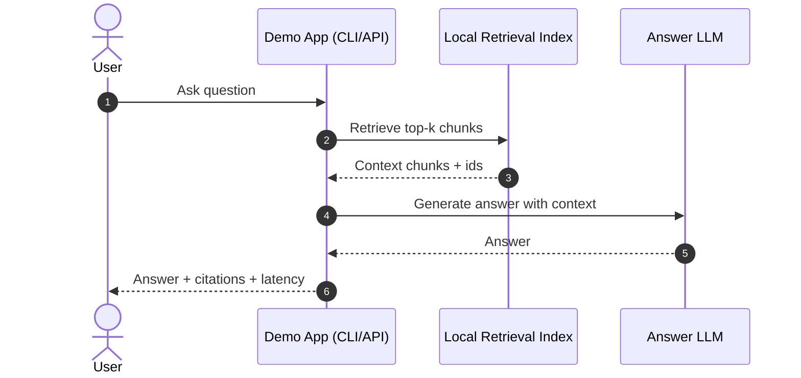

# 06-big-patent-app Architecture

## Scope

This document describes the recommended architecture for BIGPATENT loading and retrieval in two modes:

1. live user retrieval (online serving)
2. prefetch/backfill processing (offline ingestion)

## Dataset sizing (BIGPATENT `all` config)

Measured from Hugging Face dataset metadata:

- `download_size`: 17,096,051,620 bytes (~15.9 GiB)
- `dataset_size`: 42,612,380,671 bytes (~39.7 GiB)
- `train`: 1,207,222 rows, 38,367,048,389 bytes (~35.7 GiB)
- `validation`: 67,068 rows, 2,115,827,002 bytes (~2.0 GiB)
- `test`: 67,072 rows, 2,129,505,280 bytes (~2.0 GiB)

Implication: full-corpus processing should be treated as a pipeline workload, not an in-request operation.

## v0 architecture (current)

- Loader: `load_patent_records(...)` in-memory slice via `datasets.load_dataset(..., streaming=False)`
- Record schema: `PatentRecord` with normalized `text = abstract + "\\n\\n" + description`
- CLI modes:
  - `preview`
  - `stats`
  - `jsonl`

This mode is for local development and quick iteration.

## Target architecture (production-ready)

### Online serving path (live retrieval)

1. User query enters API service.
2. Query embedding is generated.
3. Retrieval uses managed search/vector index (hybrid keyword + vector preferred).
4. Top results are reranked and sent to answer generation.
5. Response is returned to the user.

Notes:

- Online path should not read raw BIGPATENT directly.
- Online path should hit prebuilt indexes/chunk stores only.

### Offline ingestion path (prefetch/backfill)

1. Source rows are read in stream/batches from BIGPATENT.
2. Rows are normalized and quality-filtered.
3. Text is chunked.
4. Chunks are embedded.
5. Chunks + vectors are upserted to retrieval index.
6. Progress is checkpointed for resume.

Notes:

- Keep ingestion and serving compute separated.
- Persist intermediate outputs (JSONL/Parquet) by partition for replay/debug.

## Sequence diagram (target architecture)

```mermaid
sequenceDiagram
    autonumber
    actor User
    participant API as API Service
    participant Cache as Redis Cache
    participant EmbedQ as Query Embedder
    participant Search as Search/Vector Index
    participant Rerank as Reranker
    participant LLM as Answer LLM

    participant Scheduler as Job Scheduler
    participant Loader as BIGPATENT Loader
    participant Chunker as Chunker
    participant EmbedD as Doc Embedder
    participant Store as Blob/Parquet Store
    participant Checkpoint as Checkpoint Store

    rect rgb(245, 250, 255)
    note over Scheduler,Checkpoint: Offline ingestion / prefetch flow
    Scheduler->>Loader: Start ingest job(config, split, shard)
    Loader->>Loader: Read records stream/batches
    Loader->>Chunker: Normalize + chunk text
    Chunker->>EmbedD: Send chunk batch for embeddings
    EmbedD->>Search: Upsert chunks + vectors
    EmbedD->>Store: Write partitioned artifacts (optional)
    EmbedD->>Checkpoint: Save last processed offset
    end

    rect rgb(245, 255, 245)
    note over User,LLM: Online retrieval flow
    User->>API: Ask question
    API->>Cache: Lookup cached response/context
    alt cache hit
        Cache-->>API: Cached result
        API-->>User: Return response
    else cache miss
        API->>EmbedQ: Embed query
        EmbedQ->>Search: Hybrid/vector retrieve top-k
        Search-->>API: Candidate chunks
        API->>Rerank: Rerank candidates
        Rerank-->>API: Top context
        API->>LLM: Generate answer with context
        LLM-->>API: Answer
        API->>Cache: Save response/context
        API-->>User: Return response
    end
```

## Compute recommendations

### Live retrieval (starting profile)

- API service: 2-4 vCPU, 8-16 GB RAM
- Retrieval backend: managed search/vector service
- Cache: managed Redis-compatible cache
- Target: retrieval p95 < 500 ms

### Prefetch/backfill (starting profile)

- Worker: 8 vCPU, 32 GB RAM (single node baseline)
- Scale out by split/shard when embedding/upsert throughput becomes bottleneck
- Store checkpoints every 5k-20k documents

## Tuning defaults

- Reader batch size: 64-256 records
- Chunking: 400-800 tokens, overlap 50-100
- Embed/upsert concurrency: 8-32 (respect rate limits)
- Partition outputs by `config/split/date/shard`
- Keep one stable loader interface (`iter_patent_records`) so backends can switch from in-memory to streaming without caller changes

## Storage targets

Two storage locations exist and serve different purposes:

1. App export output (`--out`):
   - example: `data/big_patent_v0_sample.jsonl`
2. Hugging Face cache managed by `datasets`:
   - default local cache directory (typically under `~/.cache/huggingface`)

## Operational guidance

- Use local slices for feature development and testing.
- Use pipeline jobs for full ingestion.
- Keep raw datasets out of Git repositories.

## MVP demo architecture (recommended)

Goal: maximize demo reliability with minimal moving parts.

### Scope

1. Precompute phase (run once before demo):
   - Export a fixed BIGPATENT slice (for example 5k-20k rows) to JSONL.
   - Normalize and chunk text.
   - Build a local retrieval index (BM25 or FAISS) from chunked data.
2. Live demo phase:
   - User asks a question.
   - Retrieve top-k chunks from the prebuilt local index.
   - Generate answer with LLM using retrieved context.
   - Return answer with cited chunk/document IDs.

### Why this is the best MVP

- no dependency on long-running ingestion during the demo
- deterministic dataset slice and index contents
- lower operational risk than streaming + live indexing
- still demonstrates end-to-end retrieval-augmented answering

### MVP sequence (demo path)



### Suggested demo controls

- freeze dataset config/split/limit used for index build
- keep 5-10 scripted demo questions with known good retrieval
- cache repeated responses
- always display cited source IDs for trust and explainability
