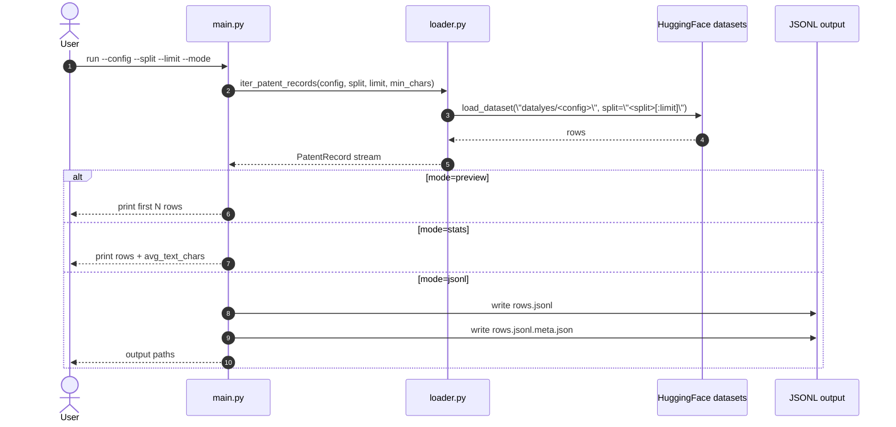

# 06-big-patent-app Architecture

## Scope

This app is now hard-cut to PatenTEB (`datalyes/*`) while keeping the previous command form and app path.

## Current v0 architecture

- Loader entrypoint: `iter_patent_records(config, split, limit, min_chars)`
- Upstream source mapping:
  - `config=retrieval_IN` -> `datalyes/retrieval_IN`
  - generally `config=<task>` -> `datalyes/<task>`
- Output schema: `PatentRecord(id, config, split, abstract, description, text)`
- CLI modes:
  - `preview`
  - `stats`
  - `jsonl` (+ metadata sidecar)

## Sequence diagram

## Operational notes

- Many PatenTEB datasets are gated; access approval and `HF_TOKEN` are required.
- The app intentionally keeps the old interface to avoid workflow breaks.
- Generated artifacts are ignored via `.gitignore` rule `data/*`.
