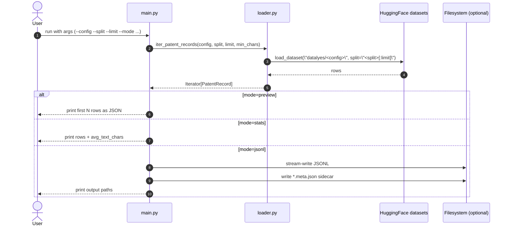

# 06-big-patent-app (v0)

Minimal PatenTEB loader for local experimentation, keeping the original CLI form.

## What it does

- hard-cuts the upstream source to PatenTEB (`datalyes/*`)
- keeps the same CLI shape: `--config --split --limit --mode`
- normalizes each row into:
  - `id`
  - `config`
  - `split`
  - `abstract`
  - `description`
  - `text`
- supports `preview`, `stats`, and `jsonl` output modes
- writes JSONL export metadata sidecar (`*.meta.json`) in `jsonl` mode

## Default demo preset

- `config=retrieval_IN`
- `split=test`
- `limit=1000`
- `min_chars=1`

## Access note (important)

PatenTEB tasks are gated on Hugging Face. You must:

1. request/accept dataset access for the selected `datalyes/<task>` dataset
2. set `HF_TOKEN` locally

Without access, loader commands fail with a gated dataset error.

## Sequence diagram



## Example usage

Preview first row:

```bash
make run-big-patent-preview LIMIT=2 PREVIEW_COUNT=1 CONFIG=retrieval_IN SPLIT=test
```

Show stats:

```bash
make run-big-patent-stats LIMIT=100 CONFIG=retrieval_IN SPLIT=test
```

Write JSONL:

```bash
make run-big-patent-jsonl LIMIT=1000 CONFIG=retrieval_IN OUT=data/big_patent_v0_sample.jsonl
```

The command also writes `data/big_patent_v0_sample.jsonl.meta.json`.

## Notes

- The app name/path stays unchanged (`06-big-patent-app`) to avoid breaking existing workflows.
- `config` now means PatenTEB task name (for example `retrieval_IN`).
- You can also pass a full dataset id in `--config` (for example `datalyes/retrieval_IN`).
