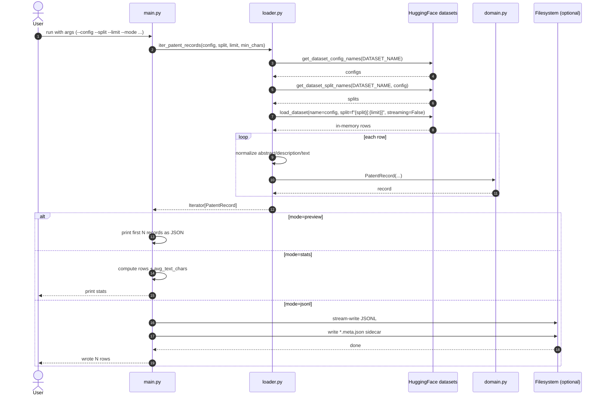

# 06-big-patent-app (v0)

Minimal BIGPATENT loader for local experimentation.

## What it does

- loads a deterministic in-memory slice from `NortheasternUniversity/big_patent`
- normalizes each row into:
  - `id`
  - `config`
  - `split`
  - `abstract`
  - `description`
  - `text` (`abstract + "\n\n" + description`)
- exposes `iter_patent_records(...)` as the primary loading interface
- keeps `load_patent_records(...)` as compatibility wrapper
- supports `preview`, `stats`, and `jsonl` output modes
- writes JSONL export metadata sidecar (`*.meta.json`) in `jsonl` mode

## Sequence diagram



## Default demo preset

- `config=all`
- `split=train`
- `limit=10000`
- `min_chars=1`

## Example usage

Preview first 2 rows from a small slice:

```bash
uv run python src/06-big-patent-app/main.py \
  --config all \
  --split train \
  --limit 20 \
  --mode preview \
  --preview-count 2
```

Show quick stats:

```bash
uv run python src/06-big-patent-app/main.py \
  --config all \
  --split train \
  --limit 100 \
  --mode stats
```

Write JSONL:

```bash
uv run python src/06-big-patent-app/main.py \
  --mode jsonl \
  --out data/big_patent_v0_sample.jsonl
```

The command also writes `data/big_patent_v0_sample.jsonl.meta.json`.

## Notes

- This is intentionally non-streaming to keep iteration simple.
- For larger ingestion pipelines, the next step is a streaming iterator with batching and checkpoints.

## Next steps: data loading patterns

1. Keep one stable ingestion interface:
   - `iter_patent_records(config, split, limit=None, min_chars=1)`
   - v0 implementation can wrap `load_patent_records`; future versions swap backend only.
2. Add v1 streaming backend:
   - use `load_dataset(..., streaming=True)` for full-corpus processing.
   - preserve the same `PatentRecord` schema so downstream code does not change.
3. Add batched iteration:
   - `iter_patent_batches(..., batch_size=32)` for embedding/index pipelines.
4. Add checkpoint/resume:
   - persist `{config, split, last_index}` every N rows to continue interrupted jobs.
5. Add partition-aware export:
   - write JSONL shards like `data/big_patent/all/train/part-0001.jsonl` for parallel indexing.
6. Add quality filters:
   - enforce `min_chars`, max length truncation, and optional dedupe hash on `text`.
7. Add deterministic sampling:
   - `sample_seed` + `sample_rate` for repeatable small experiments without full loads.
8. Add observability:
   - periodic progress logs (`processed`, `kept`, `filtered`) and elapsed time per 10k rows.

## Why "v0 can wrap load_patent_records"

The idea is to keep downstream code calling one iterator interface while the backend changes.

In v0, `load_patent_records` wraps `iter_patent_records` and materializes a list:

```python
def load_patent_records(config="all", split="train", limit=10000, min_chars=1):
    return list(
        iter_patent_records(
            config=config,
            split=split,
            limit=limit,
            min_chars=min_chars,
        )
    )
```

Primary interface:

```python
def iter_patent_records(config="all", split="train", limit=10000, min_chars=1):
    ...
```

Compatibility wrapper:

```python
def load_patent_records(config="all", split="train", limit=10000, min_chars=1):
    return list(iter_patent_records(...))
```

Later, `iter_patent_records` can switch to streaming without changing callers.

## Streaming integration point and usage

The integration point is still the loader interface (`iter_patent_records`), not the CLI output code.

Keep `main.py` consuming an iterator, then swap the loader implementation:

```python
from datasets import load_dataset

def iter_patent_records(config="all", split="train", limit=10000, min_chars=1):
    ds = load_dataset(
        "NortheasternUniversity/big_patent",
        name=config,
        split=split,
        streaming=True,
    )
    for index, row in enumerate(ds):
        ...
        yield PatentRecord(...)
```

## Where data is saved

There are two different storage locations:

1. Your app output file (JSONL export):
   - controlled by `--out`
   - current example: `data/big_patent_v0_sample.jsonl`
   - metadata sidecar: `data/big_patent_v0_sample.jsonl.meta.json`
   - in the Make target, default is also `data/big_patent_v0_sample.jsonl`
2. Hugging Face dataset cache files:
   - managed by the `datasets` library
   - default location is your local HF cache directory (for example under `~/.cache/huggingface`)
   - can be redirected with HF cache environment variables when needed
