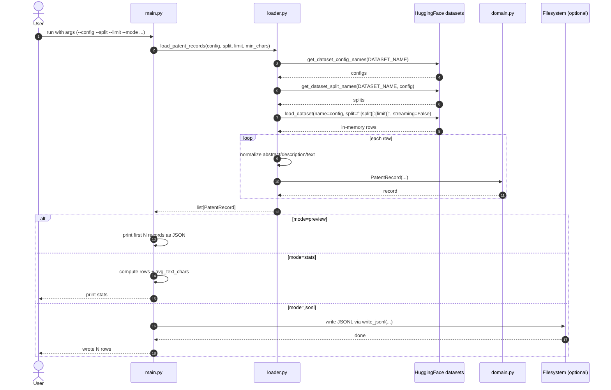

# 06-big-patent-app (v0)

Minimal BIGPATENT loader for local experimentation.

## What it does

- loads a small in-memory slice from `NortheasternUniversity/big_patent`
- normalizes each row into:
  - `id`
  - `config`
  - `split`
  - `abstract`
  - `description`
  - `text` (`abstract + "\n\n" + description`)
- supports `preview`, `stats`, and `jsonl` output modes

## Sequence diagram



## Example usage

Preview first 2 rows from a small slice:

```bash
uv run python src/06-big-patent-app/main.py \
  --config all \
  --split train \
  --limit 20 \
  --mode preview \
  --preview-count 2
```

Show quick stats:

```bash
uv run python src/06-big-patent-app/main.py \
  --config all \
  --split train \
  --limit 100 \
  --mode stats
```

Write JSONL:

```bash
uv run python src/06-big-patent-app/main.py \
  --config all \
  --split train \
  --limit 100 \
  --mode jsonl \
  --out data/big_patent_v0_sample.jsonl
```

## Notes

- This is intentionally non-streaming to keep iteration simple.
- For larger ingestion pipelines, the next step is a streaming iterator with batching and checkpoints.

## Next steps: data loading patterns

1. Keep one stable ingestion interface:
   - `iter_patent_records(config, split, limit=None, min_chars=1)`
   - v0 implementation can wrap `load_patent_records`; future versions swap backend only.
2. Add v1 streaming backend:
   - use `load_dataset(..., streaming=True)` for full-corpus processing.
   - preserve the same `PatentRecord` schema so downstream code does not change.
3. Add batched iteration:
   - `iter_patent_batches(..., batch_size=32)` for embedding/index pipelines.
4. Add checkpoint/resume:
   - persist `{config, split, last_index}` every N rows to continue interrupted jobs.
5. Add partition-aware export:
   - write JSONL shards like `data/big_patent/all/train/part-0001.jsonl` for parallel indexing.
6. Add quality filters:
   - enforce `min_chars`, max length truncation, and optional dedupe hash on `text`.
7. Add deterministic sampling:
   - `sample_seed` + `sample_rate` for repeatable small experiments without full loads.
8. Add observability:
   - periodic progress logs (`processed`, `kept`, `filtered`) and elapsed time per 10k rows.
